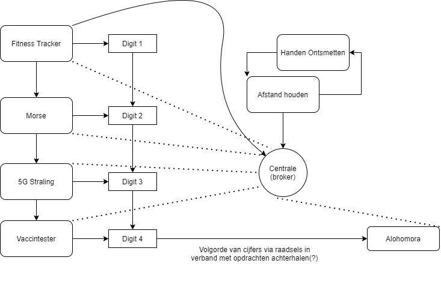

# Bachelorproject 3ELICTes/gs: Escape room

Dit is de algemene beschrijving van de escape room. De documentatie en afspraken worden bijgehouden in de [docs folder](./docs/).

## Inhoud

  
  
Klik om uit te vouwen

  
- [Bachelorproject 3ELICTes/gs: Escape room](#bachelorproject-3elictesgs-escape-room)
  - [Inhoud](#inhoud)
  - [Concept](#concept)
    - [Flow chart](#flow-chart)
    - [Verhaallijn](#verhaallijn)
      - [Fase 1: Inleiding](#fase-1-inleiding)
      - [Fase 2: Communicatie herstellen](#fase-2-communicatie-herstellen)
      - [Fase 3:](#fase-3)
      - [Fase 4:](#fase-4)
      - [Fase 5:](#fase-5)
  - [Useful links](#useful-links)
  - [Onderdelen](#onderdelen)
    - [Fitnesstracker](#fitnesstracker)
    - [Morsecode](#morsecode)
    - [5G](#5g)
    - [Vaccintester](#vaccintester)
    - [Alohamora](#alohamora)
    - [‘T is beter op anderhalve meter](#t-is-beter-op-anderhalve-meter)
    - [Ontsmetting](#ontsmetting)
  - [FAQ's](#faqs)
    - [Wat als een puzzel niet werkt?](#wat-als-een-puzzel-niet-werkt)
  {: .text-delta }

## Concept

### Flow chart

Elke deelpuzzel zal één digit van de code geven. Deze code kan dan gebruikt worden om de Alohomora puzzel op te lossen. Ondertussen zullen er steeds enkele maatregelen moeten gerespecteerd worden.

### Verhaallijn

#### Fase 1: Inleiding

Het is eind 2020. België gaat voor de tweede keer in lockdown. Vele mensen zijn hopeloos en de sfeer wordt slechter met de dag. Er is echter één lichtpuntje. Het vaccin is in de laatste fase van ontwikkeling. De hele wereld wacht in volle spanning af tot het middel klaar is.

Echter is niet iedereen zo enthousiast. Een groep anti vaxxers heeft het labo gesaboteerd door de stroom af te sluiten. Hierdoor is de ontwikkeling stil gevallen. Het is aan jullie om de productie herop te starten en het perfecte recept te vinden. Slagen jullie erin om dit binnen de tijd te doen?

#### Fase 2: Communicatie herstellen

Een goed vaccin moet ook getest worden. Dit klinisch onderzoek wordt gedaan een groep van onderzoekers, zij zijn het kloppende hart van dit labo. Door de sabotage is hier ook de communicatie weg gevallen. Ontvang de geheime boodschap en breng deze over naar het testteam zodat het klinisch onderzoek kan verder gaan.

#### Fase 3:

#### Fase 4:

#### Fase 5:

## Useful links

- [Algemeen verhaal (docs)](https://docs.google.com/document/d/1nqI-Fae9yPfaeAiZALzwLIhWo5K9UasbyvZQgVbRSb0/edit)
- [Markdown cheat sheet](https://github.com/adam-p/markdown-here/wiki/Markdown-Cheatsheet)
- VS code plugins
  - [Markdown All in One](https://marketplace.visualstudio.com/items?itemName=yzhang.markdown-all-in-one) (automatische inhoud enz.)
  - [Markdown Preview Github Styling](https://marketplace.visualstudio.com/items?itemName=bierner.markdown-preview-github-styles) (preview zoals op github, _ctrl/cmd + shift + v_ voor preview)

## Onderdelen

### Fitnesstracker

### Morsecode

In een telefoon zal er een morse code afspelen. Deze morse code zal beginnen met een hoge toon die aangeeft wat het begin is. Aan de andere kant van de kamer moet deze code worden nageklopt.
Wanneer het juist werd nageklopt zal er een cijfer tevoorschijn komen, en zullen de virologen verder kunnen met de 5G-proef. De plaats van de afstandsbediening/batterijen zal getoond worden op een display.
Wanneer de virologen de handen moeten ontsmetten, mag de opdracht niet verder gaan. De morse code zal dus stoppen en daarna pas opnieuw starten wanneer de handen ontsmet zijn.

### 5G

Wanneer de morsecode puzzel voltooid is, zal er een signaal verstuurd worden over de broker waardoor de afstand tot de stralingslocatie zal weergegeven worden (aan de hand van een led-bar) en deze kan gevonden worden. De auto is bestuurbaar met een afstandsbediening die communiceert over een frequentie van 433MHz. De besturing wisselt na een bepaalde tijd: de knop die eerst rechts was, kan nu bijvoorbeeld rechtdoor worden.

Ergens in de ruimte zal een ESP32 verstopt zijn, dit is dus de stralingslocatie. De afstand tussen die locatie en de auto zal aan de hand van RSSI Bluetooth gemeten worden en zal weergegeven worden op de led-bar. Als de auto dicht genoeg is (en dus alle ledjes branden) en er op de drukknop gedrukt wordt, zal er een kistje openen met de RFID-tag waarmee de volgende puzzel, de vaccintester, kan gestart worden.

Als de auto wordt opgenomen (dit wordt bepaald aan de hand van een afstandssensor aan de onderkant van het wagentje) zal er een buzzer afgaan en wordt de auto, bij wijze van straf, onbestuurbaar, en zal de led-bar niet meer werken. Dit is eveneens dezelfde werkwijze die wordt toegepast als de handen ontsmet moeten worden.

De digit die nodig is voor het slot (Alohamora) zal kunnen afgeleid worden aan de hand van een kaart die in de ruimte aanwezig is: de coördinaten van de stralingslocatie op deze kaart zal overeenkomen met het juiste cijfer.

### Vaccintester

Door het oplossen van de 5G-puzzle, wordt er een RFID kaart verkregen. Die kaart kan gebruikt worden om de uiteindelijke kleurensequentie voor de vaccintester te vinden. In de deur van een kast zit op een bepaalde plaats een NFC reader. De spelers moeten dan met de kaart op zoek gaan naar de kast en uitzoeken waar in de deur de NFC reader zit. Door de kaart dan te scannen worden er leds in de kast geactiveerd. Dit zijn witte leds in de kast. Boven elke witte led bevindt zich een gekleurde vloeistof in een proefbuis. De houders voor de proefbuis kunnen gebruikt worden om de witte leds weg te steken. De leds gaan in een bepaalde volgorde oplichten, zodat er een sequentie gevonden kan worden van 7 kleuren die na elkaar oplichten.
Om die kleurensequentie in te geven wordt er gebruik gemaakt van drie knoppen die verspreid zijn in de ruimte. Elke knop staat voor een bepaalde primaire kleur. Om de kleuren te vormen worden de knoppen dan ingedrukt, maar om alle spelers te laten meedoen moeten de knoppen om de kleuren te vormen binnen een bepaald interval ingedrukt worden. Zo wordt geel gevormd door groen en rood en moeten groen en rood dus ongeveer op hetzelfde moment ingedrukt worden. Die knoppen zorgen er dan voor dat de bijhorende led oplicht en via een kleursensor wordt er getest als de juiste kleur verkregen is. Wanneer de juiste kleur verkregen is wordt er gesprongen naar het volgende gebied en herhaalt het vorige zich. Wanneer de laatste kleur juist is, wordt een random getal gegenereerd dat een digit van de te zoeken code is. Deze wordt doorgestuurd naar de centrale eenheid en ook op een display getoond.

### Alohamora

Met de cijfers die gevonden werden in de vorige proeven (eventueel kan de volgorde met een puzzel achterhaald worden), kan nu een bakje met een digitaal cijferslot geopend worden. In dit bakje zit dan de sleutel om te ontsnappen uit de kamer. Hoera vrijheid!

### ‘T is beter op anderhalve meter

De onderzoekers moeten voorkomen dat ze zelf ten prooi vallen van het virus. Ze moeten dus veilig werken door steeds 1,5 meter afstand van elkaar te houden. Dit wordt geïmplementeerd door aan elke onderzoeker een mobiele node mee te geven die continu controleert of de onderzoekers niet te dicht bij elkaar komen te staan.
Wanneer dit systeem een te dichte afstand detecteert, zal er een duidelijk alarmsignaal afgaan en zullen alle onderzoekers zich moeten gaan ontsmetten. Alle opdrachten worden direct gepauzeerd totdat elke onderzoeker zijn/haar handen heeft ontsmet. Daarna kan er verder worden gewerkt.

### Ontsmetting

Zodat de Onderzoekers verder kunnen werken wanneer ze te dicht bij mekaar zijn gekomen moeten ze hun handen ontsmetten. Werk kan dus maar verdergaan wanneer dit gebeurd is.
Via een slimme ontsmettingsdispenser moet er dus bijgehouden worden of alle onderzoekers hun handen ontsmet hebben en of elke individuele onderzoeker dit gedaan heeft. Dit wordt gedaan via een nfc badge die elke onderzoeker moet scannen om ontsmetting te krijgen. De dispenser werkt volledig zonder fysiek contact aangezien deze via een afstandssensor werkt.

Wanneer elke individuele onderzoeker zijn handen ontsmet heeft is het weer veilig om verder te werken waardoor de andere puzzels terug hervat kunnen worden.

## FAQ's

### Wat als een puzzel niet werkt?

Door communicatie met de broker kan er ten allen tijde handmatig naar de volgende puzzel gegaan worden, op die manier kan geforceerd worden dat een puzzel klaar is ook al is deze defect. De missende digits zullen toch nog doorgegeven worden, bij voorkeur met de aanwezige elektronica en waar nodig met een tip.
