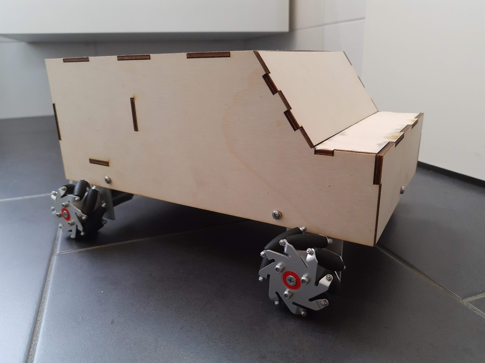
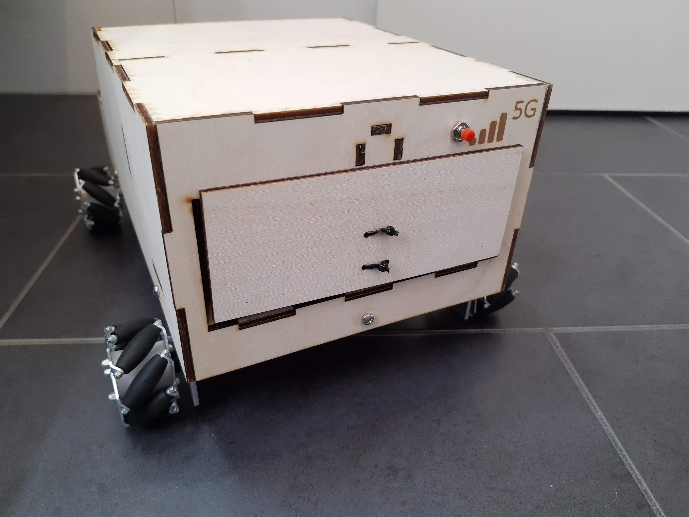
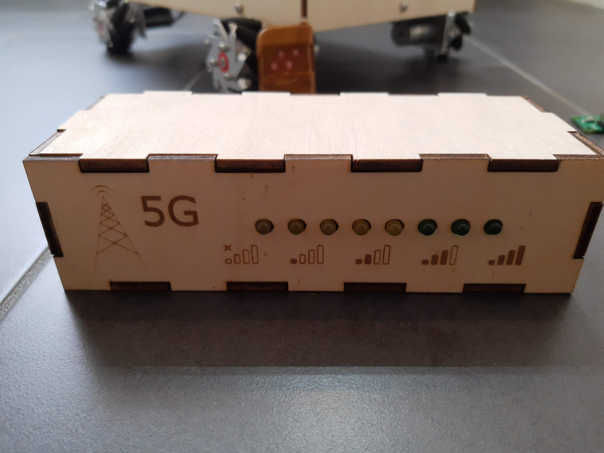

# Inhoud
- [Auto](#Auto)
  - [Afstandsbediening](#Afstandsbediening)
  - [De deur](#De-deur)
  - [Voeding](#Voeding)
  - [Anti tamper](#Anti-tamper)
  - [Motoren](#Motoren)
  - [PCB ontwerp](#PCB-ontwerp)
  - [Behuizing](#Behuizing)
  - [Motor pcb](#Motor-pcb)
- [Led-bar](#Led-bar)
- [Stralingslocatie](#Stralingslocatie)

# Auto
## Afstandsbediening
Voor het besturen van de auto wordt er gebruik gemaakt van een afstandsbediening en een ontvanger die communiceren over 433Mhz.
Het besturen van de auto gebeurt random - dus een knop moet niet specifiek gekoppeld worden aan een bepaald signaal. We maken gebruik van 4 pinnen van de ontvanger voor het bepalen of er een knop wordt ingedrukt en zo ja, welke. De interrupt op de ontvanger is zo ingesteld dat deze hoog is en blijft zodra 1 knop wordt ingedrukt. De ontvanger voorziet een interrupt signaal en een signaal per drukknop. Er kan 1 van de signalen voor de drukknoppen weggelaten worden, omdat we via uitsluitsel weten dat het de 4de is.
## De deur
Het verborgen compartiment in de auto kan geopend worden door het indrukken van een drukknop als de RSSI-waarde een bepaalde grens onderscheid. Het geraamte van de auto waarin deze deur voorzien is gelasercut. Het open van de deur gebeurd met behulp van een solenoid van 12V, die wordt geschakeld via een relais van 5V. Het aansturen van de relais gebeurt via een optocoupler: dit heeft als voordeel dat wanneer de relais een puls genereert bij het terugschakelen deze de ESP-32 niet kan beschadigen.  
## Voeding
De auto wordt gevoed door een LiPo batterij van 12V met 2400mAh. Deze spanning wordt omgevormd met een buck converter naar 5V. Deze spanning wordt gebruikt voor de afstand sensor, level shifters, enzovoort. De spanning wordt ook nog naar 3.3V gebracht met behulp van een LDO (AMS1117), dat gebruikt wordt om de ESP-32 te voeden.
## Anti tamper
Omdat we willen vermijden dat de auto kan opgenomen worden en verplaatst worden, wordt er een afstandssensor voorzien aan de onderkant van de wagen. Wanneer deze afwijkt zal er een buzzer beginnen piepen tot de auto wordt neergezet. Eenmaal neergezet zal de buzzer nog even verder gaan bij wijze van tijdstraf. De buzzer is een active buzzer - dus deze moet geschakeld worden met een DC spanning van 5V. Omdat dit een verbruiker is en geen stuursignaal maken we gebruik van een N-mosfet voor het schakelen. 
## Motoren
De motoren (FIT0441) hebben een ingebouwde sturing en kunnen gestuurd worden via een PWM signaal en een stuursignaal dat hoog of laag is, afhankelijk van de gewenste richting. We maken gebruik van mecanum wielen; deze zijn in staat om in alle richtingen te rijden, zoals weergegeven op onderstaande afbeelding. (Under construction: toevoegen afbeelding)
Het is niet nodig om elk wiel afzonderlijk te kunnen bedienen - vooruit, achteruit, links en recht zijn voldoende. We hebben dus met een afstandsbediening van 4 knoppen voldoende. Graag hebben we ook dat de wielen kunnen bestuurd worden met zo weinig mogelijk pinnen - indien we kiezen voor A en E en hun inverse hebben de wielen links en rechts steeds dezelfde richting en hebben alle wielen steeds dezelfde snelheid. Dit maakt dat we alle wielen kunnen besturen met slechts 3 signalen. 
Het PWM signaal kan gegeneerd met "ledcWrite()" deze laat ons toe om de frequentie en duty-cycle aan te passen.
## PCB ontwerp

Het volledige KiCAD project is terug te vinden [hier](https://github.com/5Gstraling/autopcb).
## Behuizing

[Hier](https://github.com/Project-ES-20-21/5G-Stralingslocatie/tree/main/Algemeen/Lasercut%20Files) vindt u alle SVG-files.
Er is ook gebruik gemaakt van een [bevestingstuk voor de afstandsensor](https://github.com/Project-ES-20-21/5G-Stralingslocatie/tree/main/Algemeen/3D-print%20Files). Als ook een [koppelstuk voor de wielen](https://github.com/Project-ES-20-21/5G-Stralingslocatie/tree/main/Algemeen/3D-print%20Files). 
# PCB motor
Voor het aankoppelen motoren maken we gebruik van een extra PCB zodat de 5 kabels per motor niet rechtstreeks op het pcb van de auto worden aangekoppeld. De keuze voor dit extra PCB zorgt er ook voor dat er zo weinig mogelijk kabel gebruikt wordt. Ook omdat de voeding van de motoren elk maar een maximale stroom van 0,7A kunnen trekken is dit een goede keuze.

Het volledige KiCAD project is terug te vinden [hier](https://github.com/5Gstraling/MotorPCB).
# LED-bar
De LED-bar wordt gevoed door een powerbank. Dit omdat de LED-bar 8 LEDs heeft (die elk 20mA verbruiken) en zo het stroomverbruik een stuk hoger ligt dan bij de stralingslocatie. Qua hardware is hier niets speciaal gebruikt - enkel de al vermelde LEDs met natuurlijk hun voorschakelweerstand. Er is ook hier een behuizing gelasercut. Het is wel belangrijk op te merken dat niet alle kleuren LEDs kunnen gebruikt worden, aangezien de ESP-32 maar een spanning op de GPIO pinnen kan aanleggen van 3,3V - bij sommige kleuren ligt de drempelspanning hoger.

Het volledige KiCAD project is terug te vinden [hier](https://github.com/5Gstraling/5G---LEDbar).

[Hier](https://github.com/Project-ES-20-21/5G-Stralingslocatie/tree/main/Algemeen/Lasercut%20Files) vindt u alle SVG-files.
# Stralingslocatie
De stralingslocatie is een PCB met een ESP-32 dat een WiFi-netwerk opzet. Aan de hand van dit netwerk kan de ESP-32 uit de auto RSSI-waardes bepalen en kan de afstand berekend worden tussen beide ESP’s. Voor de voeding is er een batterijhouder voorzien voor 4 AA-batterijen, wat neerkomt op een theoretische spanning van 4x1,5V=6V. Hier volstaan batterijen en is het niet nodig een powerbank te voorzien. De stralingslocatie wordt ergens ingebouwd in de kamer, bijvoorbeeld in een meubel of een doos, waardoor de printplaat en batterijen niet zichtbaar zijn.

Het volledige KiCAD project is terug te vinden [hier](https://github.com/5Gstraling/5G---Stralingslocatie).
