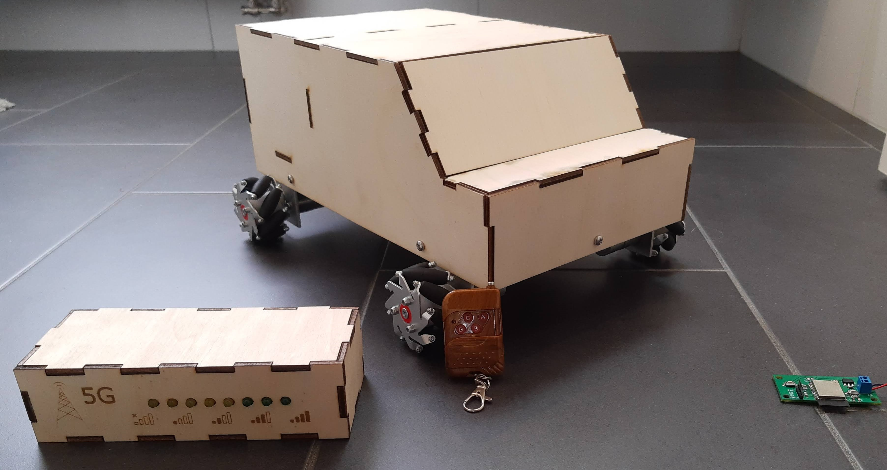
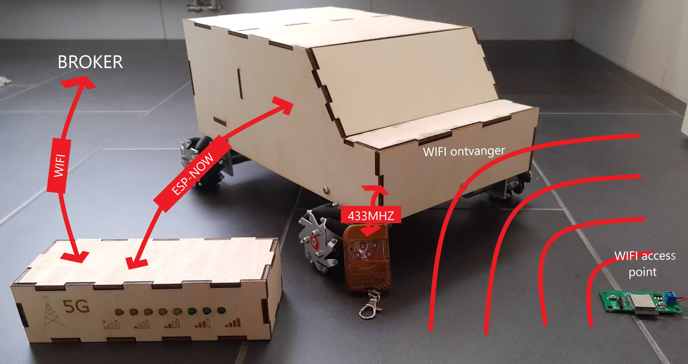

# 5G = Corona

## Inhoud
 
- [Algemeen](#Algemeen)
- [Opstelling](#Opstelling)
- [Blokschema](#Blokschema)
- [Communicatie](#Communicatie)
  - [afstandsbediening -> auto](#afstandsbediening---auto)
  - [auto -> led-bar](#auto---led-bar)
  - [broker -> led-bar](#broker---led-bar) 
- [Mogelijke fouten](#Mogelijke-fouten)
 

## Algemeen
Wanneer de morsecode puzzel voltooid is, zal er een signaal verstuurd worden over de broker waardoor de afstand tot de stralingslocatie zal weergegeven worden (aan de hand van een led-bar) en deze kan gevonden worden. De auto is bestuurbaar met een afstandsbediening die communiceert over een frequentie van 433MHz. De besturing wisselt na een bepaalde tijd: de knop die eerst rechts was, kan nu bijvoorbeeld rechtdoor worden.
Ergens in de ruimte zal een ESP-32 verstopt zijn, dit is dus de stralingslocatie. De afstand tussen die locatie en de auto zal aan de hand van de sterkte van een WiFi-signaal gemeten worden en zal weergegeven worden op de led-bar. De auto en de led-bar communiceren via ESP-now. Als de auto dicht genoeg is (en dus alle ledjes branden) en er op de drukknop gedrukt wordt, zal er een kluis openen in de wagen met de RFID-tag. Met deze tag kan de volgende puzzel, de vaccintester, gestart worden.

Als de auto wordt opgenomen - dit wordt bepaald aan de hand van een afstandssensor aan de onderkant van het wagentje - zal er bij wijze van straf een buzzer afgaan en zal de led-bar niet meer werken. Hierdoor kan de afstand tot de stralingslocatie niet meer afgelezen worden. Dit is dezelfde werkwijze die wordt toegepast als de handen ontsmet moeten worden, afgezien van de buzzer.
Het cijfer dat nodig is voor het slot (zie puzzel Alohamora) zal kunnen afgeleid worden aan de hand van een kaart die in de ruimte aanwezig is: de coördinaten van de stralingslocatie op deze kaart zal overeenkomen met het juiste cijfer.
## Opstelling

## Blokschema

## Communicatie

### auto -> led-bar
Tussen de Auto en de led-bar wordt er in 1 richting gecommuniceerd via ESP-now. De RSSI-waarde wordt van de auto naar de led-bar gestuurd als een integer.
### afstandsbediening -> auto
De afstandsbediening communiceert over 433Mhz met een ontvanger aangesloten aan de auto.
### broker -> led-bar
De led-bar vraagt enkele signalen op om te weten wat de toestand is van de globale puzzel. Dit gebeurt via MQTT volgens de afgesproken [richtlijnen](https://project-es-20-21.github.io/General/MQTTchannels.html) hierrond.

## Mogelijke fouten
- Indien de auto niet rijdt kan het best eerste alle verbindingen gecontroleerd aan de motoren. De verbinding tussen de connectoren en de kabel durven al eens een slecht contact te geven met als gevolg dat de auto niet rijdt.
- Indien er problemen zijn met de RSSI-waarden door te sturen kan dit komen doordat het kanaal van de stralingslocatie verkeerd is ingesteld. Dit kunt u nakijken met een app zoals wifi-analyzer. Meer uitleg vind u terug [hier](https://project-es-20-21.github.io/General/docs/5g/software.html#Opmerkingen).
- Een mogelijke verbetering voor deze puzzel zou zijn dat er gebruik gemaakt wordt van motoren met een hoger koppel: de motoren die voorzien waren (FIT0441) hebben een koppel van 2.4kg\*cm. Deze motoren hebben soms niet voldoende kracht om de auto in beweging te krijgen dit treed voornamelijk op als een wiel in een voeg is komen te zitten.
- De fouten die kunnen optreden zorgen bijna steeds voor het niet kunnen voltooien van de puzzel. Behalve voor het beetje vooruitduwen van de wagen kan er niet veel gedaan worden van buitenaf of door de spelers. Het beste in deze situaties is dat de locatie waarnaar de auto moet verplaatst worden wordt doorgegeven aan de spelers. En vandaar kan er verder gespeeld worden.
