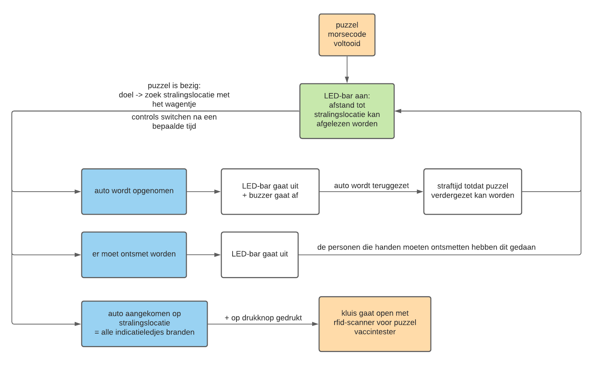

# 5G = Corona

## Inhoud
 
- [Algemeen](#Algemeen)
- [Blokschema](#Blokschema)
- [Communicatie](#Communicatie)
  - [afstandsbediening -> auto](#afstandsbediening---auto)
  - [auto -> ledbar](#auto---ledbar)
  - [broker -> ledbar](#broker---ledbar) 
- [Error Handling](#Error-Handling)
 

## Algemeen
Wanneer de morsecode puzzel voltooid is, zal er een signaal verstuurd worden over de broker waardoor de afstand tot de stralingslocatie zal weergegeven worden (aan de hand van een led-bar) en deze kan gevonden worden. De auto is bestuurbaar met een afstandsbediening die communiceert over een frequentie van 433MHz. De besturing wisselt na een bepaalde tijd: de knop die eerst rechts was, kan nu bijvoorbeeld rechtdoor worden.
Ergens in de ruimte zal een ESP32 verstopt zijn, dit is dus de stralingslocatie. De afstand tussen die locatie en de auto zal aan de hand van de sterkte van een wifi signaal gemeten worden en zal weergegeven worden op de led-bar. De auto en de led-bar communiceren via esp now. Als de auto dicht genoeg is (en dus alle ledjes branden) en er op de drukknop gedrukt wordt, zal er een kluis(in de auto) openen met de RFID-tag waarmee de volgende puzzel, de vaccintester, kan gestart worden.
Als de auto wordt opgenomen (dit wordt bepaald aan de hand van een afstandssensor aan de onderkant van het wagentje) zal er een buzzer afgaan en wordt de auto, bij wijze van straf, onbestuurbaar, en zal de led-bar niet meer werken. Tevens zal er ook een buzzer weerklinken.  Dit is eveneens dezelfde werkwijze die wordt toegepast als de handen ontsmet moeten worden. Afgezien van de buzzer.
De digit die nodig is voor het slot (Alohamora) zal kunnen afgeleid worden aan de hand van een kaart die in de ruimte aanwezig is: de coördinaten van de stralingslocatie op deze kaart zal overeenkomen met het juiste cijfer.

## Blokschema

## Communicatie
### auto -> ledbar
Tussen de Auto en de ledbar wordt er in 1 richting gecommuniceerd via esp now. De rssi waarde wordt van de auto naar de ledbar gestuurd als integer.
### afstandsbediening -> auto
De afstandsbediening is verbonden communiceert over 433Mhz met een ontvanger aangesloten aan de auto.
### broker -> ledbar
De ledbar vraagt enkele signalen op om te weten wat de toestand is van de globale puzzel. Dit gebeurt via Mqtt volgens de afgesproken [richtlijnen](https://project-es-20-21.github.io/General/MQTTchannels.html) hierrond.
## Error Handling
- Voor dat u dat veel handelingen onderneemt kunt u het best eerst alle verbindingen eens nakijken. Slecht contact aan de motoren of pcb vormen de grootste problemen.
- Indien er problemen zijn met de rssi waarden door te sturen kan dit komen doordat het kanaal verkeerd is ingesteld van de stralingslocatie. Dit kunt u nakijken met een app zoals wifi-analyzer. Meer uitleg vind u terug [hier](https://project-es-20-21.github.io/General/docs/5g/software.html#Opmerkingen).
- Een mogelijke verbetering voor deze puzzel zou zijn dat er gerbuik gemaakt wordt van motoren met een hoger koppel. De motoren die voorzien hadden waren hebben 2.4kg*cm. Deze motoren hadden soms het nadeel dat ze niet steeds voldoende grip/koppel hadden waardoor de auto niet even goed rijde steeds.
