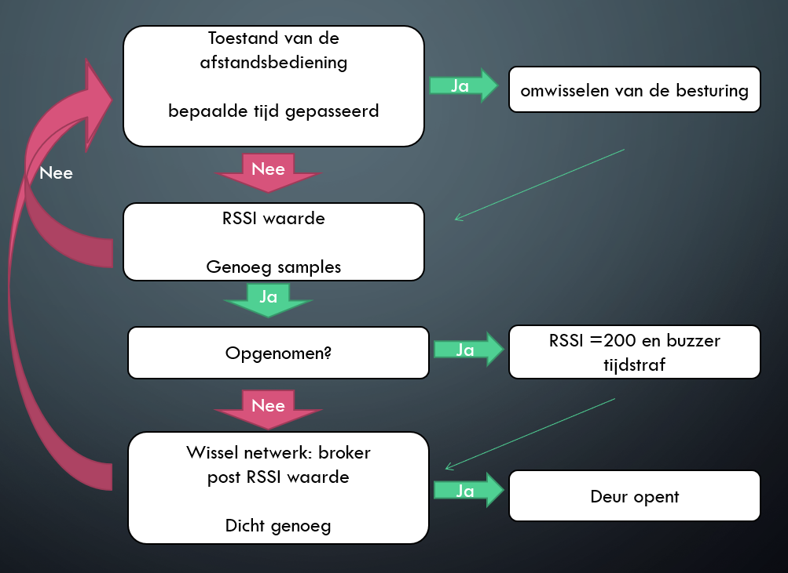

# Inhoud 
- [code](#code)
  - [stralingslocatie](#stralingslocatie)
  - [led-bar](#led-bar)
  - [auto](#auto) 
- [opmerkingen](#opmerkingen)
  - [communicatie](#communicatie)
  - [afstandsensor](#afstandsensor)
 
# code
De code van de verschillende onderdelen van deze puzzle vindt u hieronder terug.
## stralingslocatie
De stralingslocatie voorziet enkel een WiFi access point. Doordat de auto wilt communiceren met de led-bar via ESP-NOW moeten beide ESP's verbonden worden met een WiFi-netwerk dat zich op hetzelfde kanaal bevindt. Een goede oplossing zou zijn dat het algemene WiFi-netwerk wordt gebruikt als stralingslocatie maar voor technische reden was dit niet mogelijk bij het ontwikkelen. Het WiFi-kanaal dat de ESP gebruikt kan ingesteld worden via "softap()".
[Code](https://github.com/Project-ES-20-21/5G-Stralingslocatie/tree/main/Code/ESP32%20-%20Stralingslocatie)
## led-bar
De led-bar is verbonden met MQTT en is gesubscribed op "esp32/morse/output" om te weten wanneer deze puzzel ten einde is, alsook het kanaal voor de algemene puzzel voor het ontsmetten en fitness. Zo kunnen de ledjes uitgeschakeld worden bij het ontsmetten of als er geen energie meer is. De led-bar is ook verbonden via ESP-NOW naar de auto om zo de RSSI-waarde te ontvangen. In de code wordt de energietoestand waarin de ESP-32 zich bevindt aangepast, omdat door gebruik te maken van MQTT de energietoestand wordt aangepast zodanig dat de ESP niet steeds attent is voor het ontvangen van ESP-NOW communicatie. De RSSI-waarde wordt vervolgens omgezet naar een afstand. Dit gebeurt via 2 parameters die gevonden kunnen worden door de led-bar te kalibreren. Dit gebeurt door de RSSI-waarde manueel op te meten met behulp van de ESP-32 via seriele monitor, en dit bij een afstand van 1m en 3m. Er kan gebruik gemaakt worden van volgend [geogebra script](https://www.geogebra.org/m/nmsr7rs8). Hier wordt de afstand in functie van de rssi waarde geplot. In de functie zelf moet de afstand op 1m ingevuld worden en vervolgens kan met de slider de factor bepaald worden zodanig dat de 3m waarde overeenkomt.
[Code](https://github.com/Project-ES-20-21/5G-Stralingslocatie/tree/main/Code/ESP32%20-%20LEDbar)
## auto
Voor de auto ziet de code er als volgt uit.

[Code](https://github.com/Project-ES-20-21/5G-Stralingslocatie/tree/main/Code/ESP32%20-%20auto)
# opmerkingen
## communicatie
De manier van communiceren in de puzzel zelf, alsook met de broker, is zo gekozen omdat er enkele zaken zijn waar mee rekening moest gehouden worden. Met de gebruikte ESP-32 met 4MB flash memory is het niet mogelijk om zowel MQTT als Bluetooth te gebruiken. Het wisselen tussen 2 WiFi-netwerken (ook al gebruik je een statisch IP-adres) zorgt voor veel vertraging. ESP-NOW moet op beide ESP-32's op hetzelfde WiFi-kanaal zitten - hierdoor moet de stralingslocatie hetzelfde WiFi-kanaal gebruiken als de WiFi waarop de broker zit. Dit is niet een ideale situatie, maar om met ESP-NOW te willen werken de enige mogelijkheid. Dit is omdat de led-bar namelijk al een kanaal toegewezen krijgt door het verbinden met de broker, en aangezien we willen communiceren met de auto moet deze hetzelfde kanaal hebben. Dit kan dus enkel als ook deze ESP-32 verbonden is met een WiFi-signaal op hetzelfde WiFi-kanaal.
## afstandsensor 
In de code wordt de afstand twee keer na elkaar gechecked, alvorens het alarm af gaat. Dit is om te vermijden dat door omgevingsfactoren, zoals voegen in de vloer als de wagen rijdt, dit onnodig afgaat. Uit verschillende testen is gebleken dat dit een simpele oplossing is met een goed resultaat.
