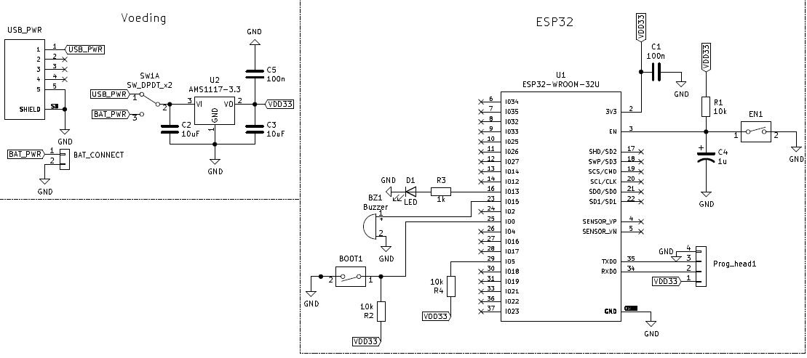
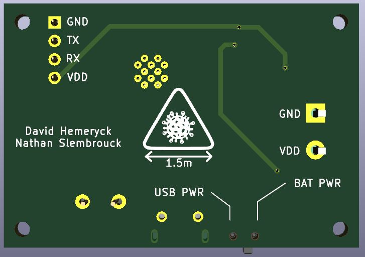

## Hardware
#### Gebruikte componenten:

| Component                       | type            | gebruik |
| ESP32-WROOM-32UE 4MB FLASH      | micro processor  | verzenden BLE signalen, RSSI metingen, controleren van veilige afstand, communicatie met broker|
| AMS1117-3.3                     | LDO                  | conversie van inputspanning naar een stabiele 3.3V voeding  |
| Conrad Components 93038c213a    | buzzer               | piept wanneer de speler te dicht bij een andere speler staat  |
| MOLEX 105017-1001                | micro-usb            | voeding vanuit een 5V powerbank/oplader|
| diverse modellen                  | printkroonsteentje    | voeding vanuit een 9V batterij |
| On Shine Enterprise Surface Mount Right Angle Switch | bistabiele schakelaar | keuzeschakelaar voor voeding uit usb versus uit batterij |
| A24-HABUF-P5I-ND                 | omnidirictionele antenne | verzenden en ontvangen van wifi en ble signalen |

##### ESP32-WROOM-32UE 4MB FLASH
De ESP32 is een MCU met geïntegreegde wifi -en bluetooth capaciteiten ontworpen door Espressif Systems. De ESP32 heeft veel geïntegreerde features en is vooral gefocust op IoT-applicaties. In dit project voert de ESP32 alle taken uit: hij verzendt de BLE signalen, meet de RSSI-waardes van binnenkomende BLE-signalen, controleert deze waarden en verzorgt communicatie met de rest van de escape room aan de hand van mqtt. Ook belangrijk is dat deze ESP32 versie een ipex-aansluiting heeft om een externe antenne te kunnen aansluiten. Deze externe antenne is cruciaal voor een nauwkeurige meting van de RSSI-waardes.

##### Voeding
* Toegestane spanning aan USB poort of batterij: 5V - 12V 
* Gemiddele getrokken stroom bij nominale werking met 9V baterij: 134 mA
* Verbruikt vermogen bij een ingangsspanning van 8.82V: 1.18 Watt
* Uit veiligheidsoverwegingen wordt aangeraden om nooit tegelijkertijd een voeding op de USB of batterij aan te sluiten wanneer de programmeerpinnen worden gebruikt. Twee         voedingen zou tot overbelasting kunnen leiden.
* De ESP32 werkt op 3,3 Volt. Om deze spanning te verzekeren wordt er gebruik gemaakt van de AMS111-3.3, een LDO die spanningen tot 12V stabiel kan converteren naar 3v3. De spanning aan de ingang van deze LDO kan op twee manieren geleverd worden: ofwel via de batterij-aansluiting ofwel via micro-usb. Tussen deze twee ingangen kan worden geschakeld via de bistabiele schakelaar. Voor montage op het faceshield werd een 9V batterij gekozen als voeding omdat deze veel voorkomen en gemakkelijk te integreren in de behuizing zijn. 9 Volt batterijen zijn er ook in herlaadbare variant wat voor deze schakeling interessant kan zijn vanwege het redelijk hoge vermogenverbruik (1.18 Watt).

##### Buzzer en LED
* Aansturing buzzer: IO-pin 15
* Aansturing LED: IO-pin 13
* De buzzer wordt gebruikt om 5 seconden geluid te maken wanneer de module een te dichte afstand tussen zichzelf en een andere module heeft gedetecteerd. De LED heeft op zich geen specifiek nut maar kan worden gebruikt bij het debuggen.

##### Antenne
Een goede omnidirectionele antenne is cruciaal voor een correcte RSSI meting in elke richting. Experimenteel is ondervonden dat een externe antenne beter omnidirectioneel is en de BLE-signalen krachtiger kan verzenden en ontvangen. Dit komt de nauwkeurigheid sterk ten goede omdat de afstand tegenover een zender een exponentieel verband kent. Dit betekent dat hoe dichter men bij de bron komt, hoe sterker de RSSI-waardes zullen variëren. Deze extra gevoeligheid zorgt ervoor dat er een groter verschil ligt tussen bijvoorbeeld 1.4 meter en 1.6 meter dan 10 meter en 10.5 meter waardoor we de RSSI-grenswaarde op 1.5 meter beter kunnen specifiëren. Voor meer informatie over deze grenswaarde, zie [software](https://project-es-20-21.github.io/General/docs/Afstand/Software.html).

#### PCB

##### Schema van de PCB
[uitvergrote versie](schema_pretty.png)

##### Bovenaanzicht van de PCB

##### Onderaanzicht van de PCB

