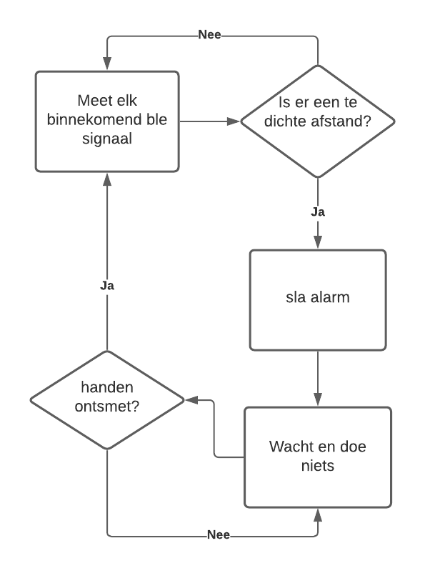

## Hardware
#### Gebruikte componenten:
| Component                       | type            | gebruik|
| --------------------------------|:---------------:|:------|
| ESP32-WROOM-32UE 4MB FLASH      | micro processor  |verzenden BLE signalen, RSSI metingen, controleren van veilige afstand, communicatie met broker|
| AMS1117-3.3                     | LDO                  |conversie van inputspanning naar een stabiele 3.3V voeding  |
| nog vragen                      | buzzer               |    piept wanneer de speler te dicht bij een andere speler staat  |
|MOLEX 105017-1001                | micro-usb            | voeding vanuit een 5V powerbank/oplader|
|nog te bekijken                  |printkroonsteentje    | voeding vanuit een 9V batterij         |
|nog te bekijken                  | bistabiele schakelaar| keuzeschakelaar voor voeding uit usb versus uit batterij |
|W1049B030                        | omnidirictionele antenne| verzenden en ontvangen van wifi en ble signalen|

#### PCB

#### Voeding
Toegestane spanning aan USB poort of batterij: 5V - 12V  
Gemiddele getrokken stroom bij nominale werking met 9V baterij: 134 mA  
Verbruikt vermogen bij een ingangsspanning van 8.82V: 1.18W   
Uit veiligheidsoverwegingen wordt aangeraden om nooit tegelijkertijd een voeding op de USB of batterij aan te sluiten wanneer de programmeerpinnen worden gebruikt.
