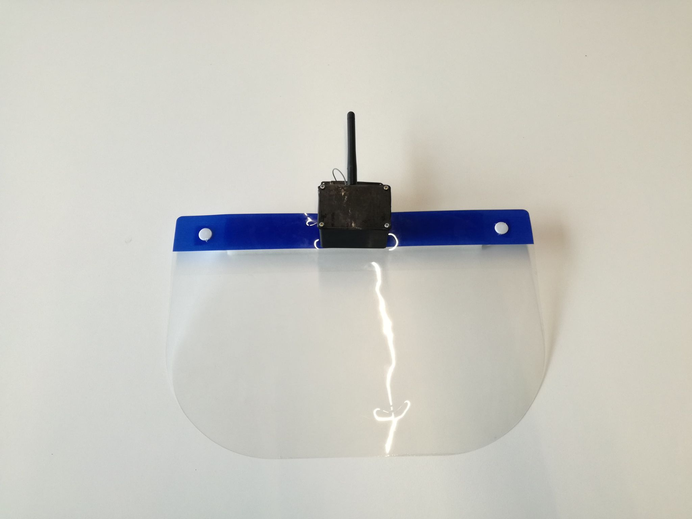

## Opstelling
De module wordt gedragen door de spelers. Voor een correcte meting is het noodzakelijk dat de antenne bovenop het hoofd gedragen wordt zodat er een minimale verstoring is van het signaal en meting. In de achterkant van de behuizing zitten vier schroefgaten waardoor schroeven aan een klemplaatje kunnen worden gedraaid. Op deze manier kan de schakeling gemonteerd worden op een faceshield, maar ook een hoofdband of pet bijvoorbeeld zijn mogelijk.  
 
Bij de antenne zit een mounting ring meegeleverd. Deze ring past op de mounting hole op de bovenkant van het deksel. Zorg ervoor dat de antenne loodrecht naar boven wijst. Dit deksel kan zowel rechtstreeks op de rest van de behuizing gezet worden of kan op een andere locatie dienen als hulpmiddel om de antenne te monteren. 
 
Wij verkozen om te werken met een faceshield met daarop de behuizing en de pcb. De antenne wordt naar buiten geleid en via een apart plaatje aan het faceshield bevestigd.
 

De link naar de repository van de behuizing kunt u [hier](https://github.com/blijf-weg/casing) vinden.
