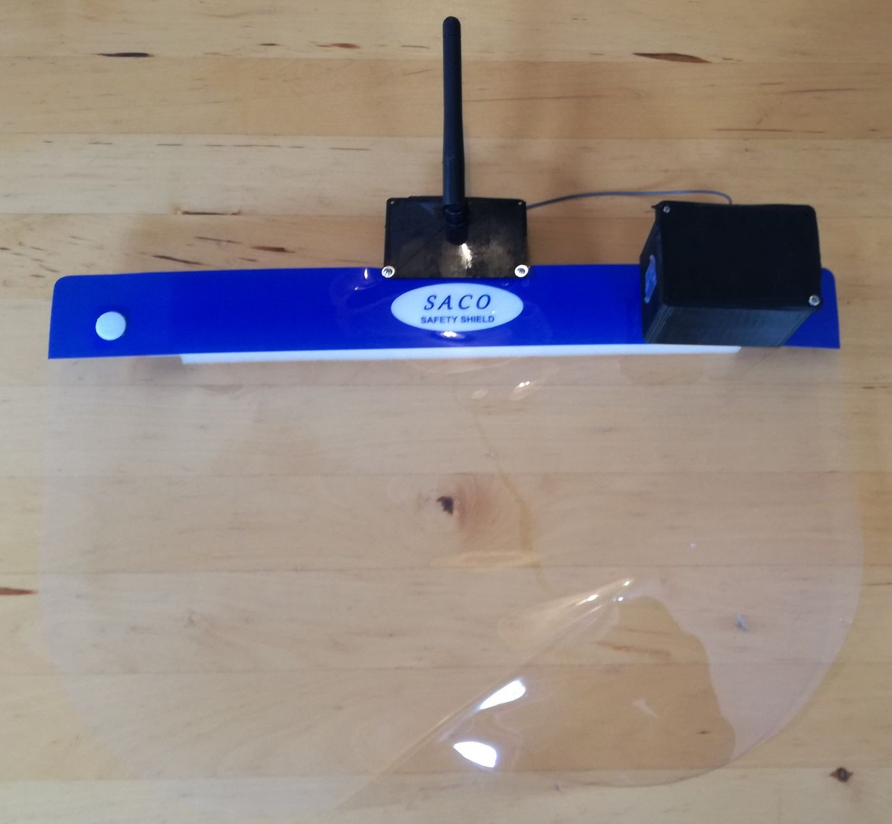

# 'T is beter op anderhalve meter
## Navigatie 
- [Algemeen](#Algemeen)
- [Blokschema](#Blokschema)
- [Opstelling](#Opstelling)
## Algemeen
Het doel van dit ontwerp is het verzekeren van een corona-veilige afstand tussen de spelers van de escaperoom. Hierdoor mogen de spelers niet binnen een afstand van 1,5 meter van elkaar komen. Wanneer een kleinere afstand gedetecteerd wordt, worden de nodige signalen verzonden om het spel te pauzeren en de spelers die te dicht staan te laten weten dat ze hun handen moeten gaan ontsmetten.
## Blokschema

## Opstelling
De module wordt gedragen door de spelers. Voor een correcte meting is het noodzakelijk dat de antenne bevenop het hoofd gedragen wordt zodat er een minimale verstoring is van het signaal en meting. In de achterkant van de behuizing zitten vier schroefgaten waardoor schroeven aan een klemplaatje kunnen worden gedraaid. Op deze manier kan de schakeling gemonteerd worden op een faceshield, maar ook een hoofdband of pet bijvoorbeeld zijn mogelijk.  
 
Bij de antenne zit een mounting ring meegeleverd. Deze ring past op de mounting hole op de bovenkant van het deksel. Zorg ervoor dat de antenne loodrecht naar boven wijst. Dit deksel kan zowel rechtstreeks op de rest van de behuizing gezet worden of kan op een andere locatie dienen als hulpmiddel om de antenne te monteren. 
 
