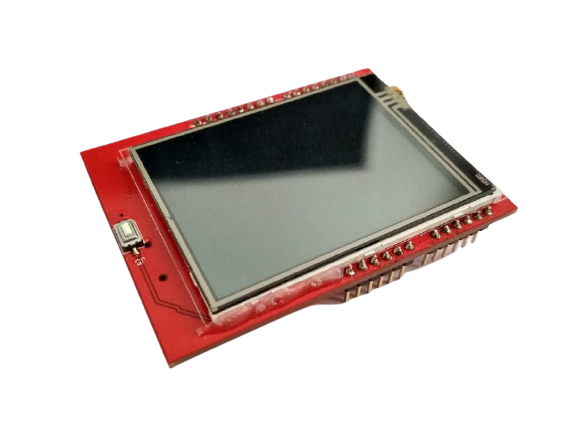
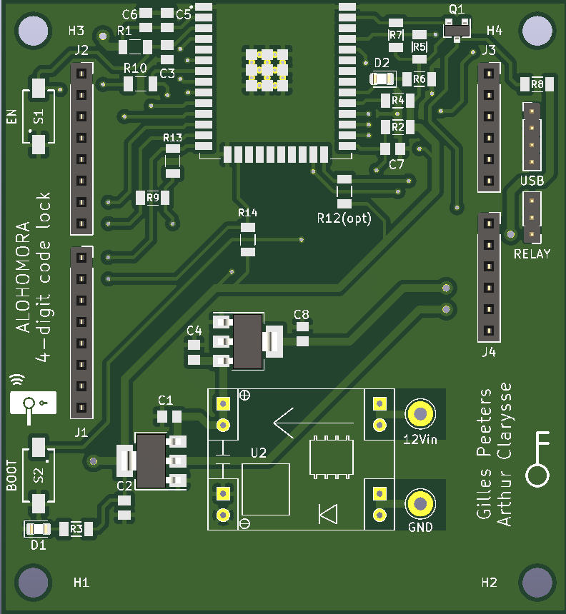
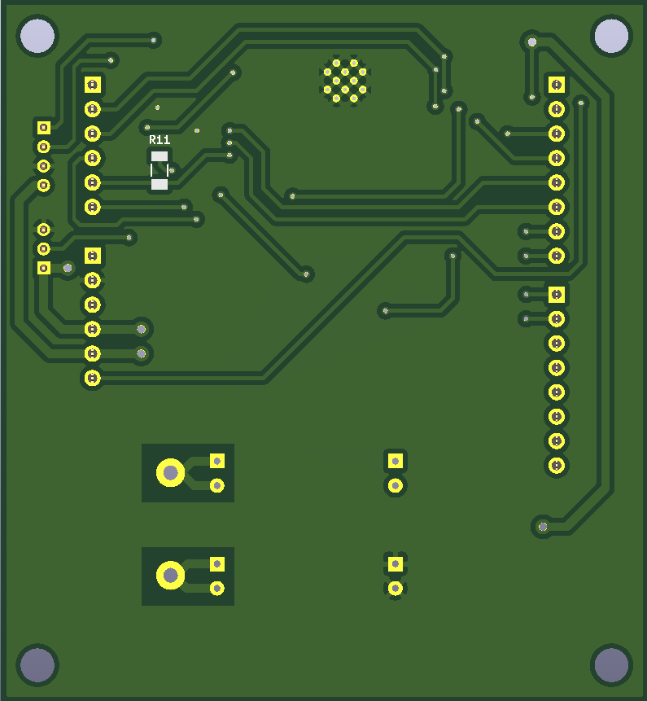
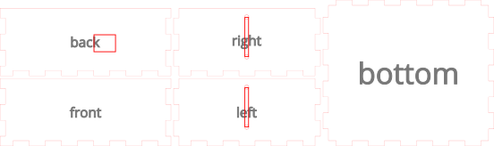
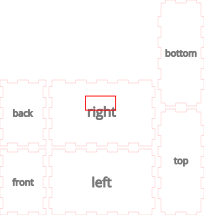

# Inhoud
- [Kluis](#Kluis)
    - [Touchscreen](#Touchscreen)
    - [Circuit](#Circuit)
    - [PCB ontwerp](#PCB-ontwerp)
    - [3D tekening](#3D-tekening)
- [Timer](#Timer)
    - [Display](#Display)
    - [Circuit](#Circuit)
    - [PCB ontwerp](#PCB-ontwerp)
    - [3D tekening](#3D-tekening)
    
# Kluis
## Touchscreen
  
De code die leidt tot het openen van de kluis zal moeten worden ingegeven via een touchscreen dat ingebouwd is in de kluis zelf. 
Het touchscreen dat we gebruiken is de TFT SPI 240x320 touchscreen LCD, dat normaal gebruikt wordt als een arduino uno shield. Wij hebben er echter op ons PCB ontwerp echter voor gezorgd dat het touchscreen op onze PCB werkt en zo verbinding maakt met de esp32.

## Circuit
De voeding van ons systeem wordt geleverd door een 11.1V lipo batterij. Deze levert een hoog genoege spanning en stroom om de solenoïde aan te sturen die de kluisdeur zal openen. Wanneer een toestand wordt bekomen die leidt tot het openen van de kluis, zal de esp32 een signaal van 3.3V op één van zijn pinnen plaatsen. Dit hoog signaal wordt gebruikt als ingang van een relais. Door het hoog worden van de pin zal een normaal open schakelaar in het relais gesloten worden. Hierdoor komt de solenoide onder de spanning van 11.1V terecht en zal deze worden ingeduwd voor een bepaalde ingeprogrammeerde tijd. Het overige gedeelte van de spanning zullen we naar beneden converteren doormiddel van een stepdown converter. Zo werkt de esp32 slechts op 3.3V.

## PCB ontwerp

## 3D tekening
Oorspronkelijk was het idee om de behuizing van de kluis te laten 3D printen. Door de omvang was het echter een beter plan om deze toch te laten lasercutten.

# Timer
Deze timer begint af te tellen vanaf wanneer het spel officieel start. 
Het geeft de spelers mee hoeveel tijd ze nog over hebben om de code te kraken en zo te ontsnappen uit de escape room. 

## Display

Om de tijd weer te geven wordt er gebruik gemaakt van een 4-digit 7-segment dispay. Via de broker wordt het start signaal gegeven om het spel te starten en vanaf dan zal de timer beginnen met aftellen. Doordat het spel exact 60 minuten duurt, hebben we met 4 digits genoeg om de spelers tot op de seconde hun resterende tijd te laten weten.

## Circuit
We weergeven alvast een vereenvoudigt schema van onze timer. Hierin vindt je de belangrijkste componenten in terug die we gebruiken om deze te laten werken.
We gebruiken een powerbank die 5V levert als voeding. Doordat het timer display zelf 5V als voeding gebruikt, kan deze hier rechtstreeks op worden aangesloten. Bij het ontwerpen van een PCB voor de esp32 moet men echter nog rekening houden met een conversie van 5V naar 3.3V wat in ons schema zelf ook gebeurd.

## PCB ontwerp

## 3D tekening

