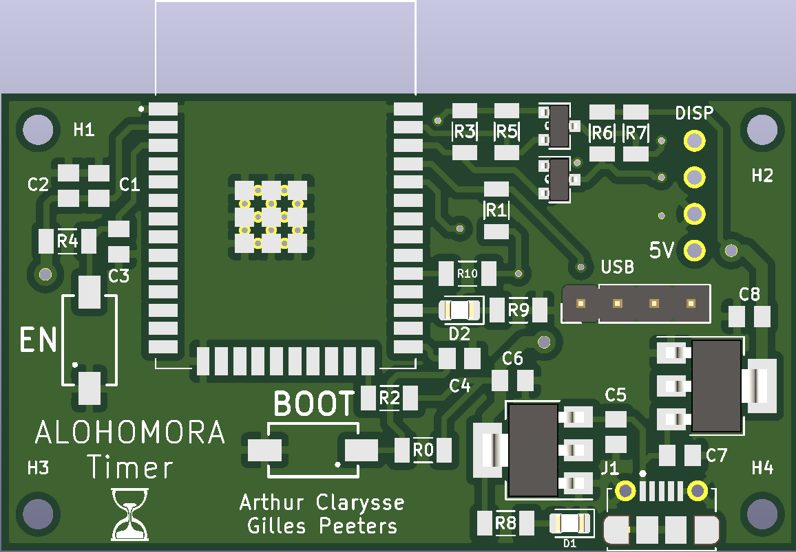
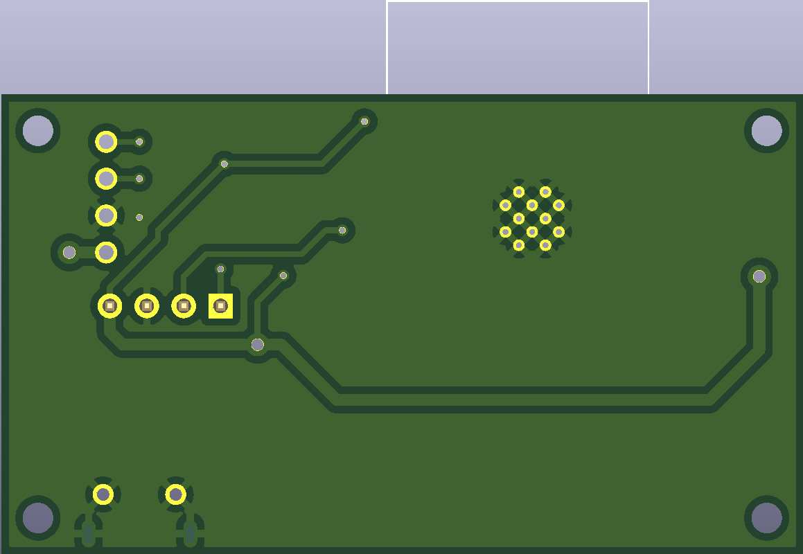

# Inhoud
- [Kluis](#Kluis)
    - [Touchscreen](#Touchscreen)
    - [Voeding](#Voeding)
    - [PCB ontwerp](#PCB-ontwerp)
    - [3D tekening](#3D-tekening)
- [Timer](#Timer)
    - [Display](#Display)
    - [Circuit](#Circuit)
    - [PCB ontwerp](#PCB-ontwerp)
    - [3D tekening](#3D-tekening)
    
# Kluis
## Touchscreen
  
De code die leidt tot het openen van de kluis zal moeten worden ingegeven via een touchscreen die ingebouwd is in de kluis zelf. 
Het touchscreen dat we gebruiken is de TFT SPI 240x320 touchscreen LCD, die normaal gebruikt wordt als een arduino uno shield. Wij hebben in ons PCB ontwerp de aansluitingen van een Arduino UNO nagebootst en de nodige aanpassingen gemaakt om de touchscreen zo goed mogelijk te doen werken met een ESP32 microcontroller.

## Voeding
De voeding van ons systeem wordt geleverd door een 11.1V lipo batterij. Deze voorziet een hoog genoege spanning en stroom om de solenoïde aan te sturen die de kluisdeur zal openen. Wanneer een actie wordt ondernomen die aanleiding geeft tot het openen van de kluis, zal de esp32 een signaal van 3.3V op één van zijn pinnen plaatsen. Dit hoog signaal wordt gebruikt om een relais aan te sturen. Door het hoog worden van de pin zal een normaal open schakelaar in het relais gesloten worden. Hierdoor komt de solenoide onder de spanning van 11.1V terecht en zal deze worden ingeduwd voor een vooraf bepaalde tijd.
De touchscreen dient gevoed te worden met een spanning van ongeveer 5V; een ingebouwde LDO zorgt er voor dat dit naar exact 5V of 3.3V wordt geconverteerd. Hierover bestaat er geen documentatie dus het is onduidelijk welke van de twee het is, we kiezen dus voor >5V om zeker te zijn.
De ESP32 wordt gevoed met 3.3V die we bekomen met een LDO die de >5V omzet naar 3.3V.

## PCB ontwerp

## 3D tekening
Oorspronkelijk was het idee om de behuizing van de kluis te laten 3D printen. Door de omvang was het echter een beter plan om deze toch te laten lasercutten.

# Timer
Deze timer begint af te tellen vanaf wanneer het spel officieel start. 
Het geeft de spelers mee hoeveel tijd ze nog over hebben om de code te kraken en zo te ontsnappen uit de escape room. 

## Display

Om de tijd weer te geven wordt er gebruik gemaakt van een 4-digit 7-segment dispay. Via de broker wordt het start signaal gegeven om het spel te starten en vanaf dan zal de timer beginnen met aftellen. Aangezien het spel maximaal 60 minuten mag duren, hebben we met 4 digits genoeg om de spelers tot op de seconde hun resterende tijd te laten weten.

## Voeding
We gebruiken een powerbank die 5V levert als voeding. Doordat het timer display zelf 5V als voeding gebruikt, kan deze hier rechtstreeks op worden aangesloten. Bij het ontwerpen van een PCB voor de esp32 moet men echter nog rekening houden met een conversie van 5V naar 3.3V wat we realiseren met een LDO.

## PCB ontwerp

## 3D tekening

