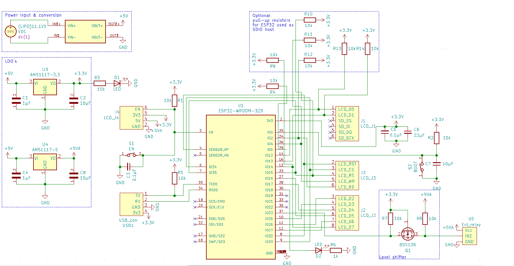
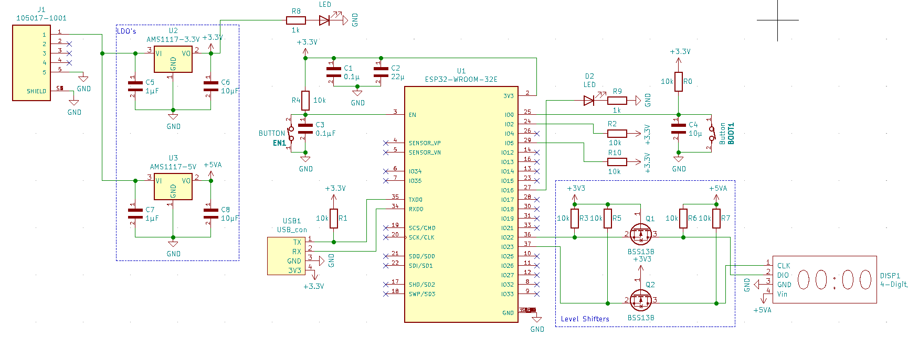

# Alohomora

## Inhoud

- [Touchlock](#Touchlock)
    - [Algemeen](#Algemeen)
    - [Blokschema](#Blokschema)
    - [Communicatie](#Communicatie)
    - [Opstelling](#Opstelling)
    - [Error handling](#Error-handling)

- [Timer](#Timer)
    - [Algemeen](#Algemeen-1)
    - [Blokschema](#Blokschema-1)
    - [Communicatie](#Communicatie-1)
    - [Opstelling](#Opstelling-1)
    - [Error handling](#Error-handling-1)

## Touchlock

### Algemeen
De touchlock bestaat uit een touchscreen met een 4-digit cijferslot dat toegang verleent tot een compartiment met de sleutel die gebruikt kan worden om te ontsnappen uit de escape room. Dit is de laatste stap die nodig is om te ontsnappen uit de escape room en gebruikt cijfers die verkregen zijn in alle voorgaande proeven.

De bedoeling van de interface op de touchscreen is dat deze vrij intuïtief is, zonder extra uitleg zou alles duidelijk moeten zijn. Het is wel zo dat men pas kan weten dat er maar 3 pogingen zijn na de eerste foute poging. Bij 3 foute pogingen zal het slot ook openen maar dan wel met de boodschap 'GAME OVER' op het scherm.

De touchscreen zelf zal niet responsief zijn tot alle nodige info doorgestuurd is via MQTT en de wifi kan afgesloten worden op de ESP32. Dit is een gevolg van het feit dat voor touchscreen functionaliteit nagenoeg alle pins van de ESP32 beschikbaar moeten zijn, sommige moeten zelf doorverbonden worden. De wifi functionaliteit gebruikt een aantal van deze pins als register, een fout signaal kan bijvoorbeeld het SSID of wachtwoord voor de verbonden router resetten. Aangezien dit gedrag in zekere zin handig is zien we dit als een feature en omzeilen we de beperkingen van de ESP32 door de code in 2 fases op te delen; met wifi en zonder wifi. 

Door dit gedrag van de ESP32 is er wel geen manier om het slot vanop afstand te openen eens de wifi uitgeschakeld is. Om hier eventuele problemen op te lossen voorzien we simpelweg code '0000' als noodoplossing moest iemand in de kamer zelf in paniek raken. Als de wifi nog aan staat kan er simpelweg van buitenaf een signaal gestuurd worden om het compartiment met de sleutel te openen.

### Blokschema

Voor een schaalbare afbeelding van ditzelfde schema klik [hier](https://github.com/Project-ES-20-21/General/blob/gh-pages/docs/Alohomora/pcb_schermv2.svg).

### Communicatie
Alle communicatie verloopt via de broker. De touchlock ontvangt in principe alleen maar data en verzendt zelf slechts 1 keer naar een kanaal van de timer, behalve dan voor debug doeleinden zal meer gebruik worden gemaakt van publish functies. De gebruikte channels zijn:
- "esp32/alohomora/control" dit kanaal wordt enkel gebruikt als er handmatig moet ingegrepen worden wanneer de ESP32 nog in wifi mode staat. Bij perfecte werking wordt dit kanaal in principe niet benut.
- "esp32/alohomora/code1" de kanalen van deze vorm hebben als enig nut om de correcte digit te ontvangen en die op de daarmee corresponderende positie in de code te plaatsen.
- "esp32/alohomora/code2","esp32/alohomora/code3","esp32/alohomora/code4" zie hierboven.

Wanneer de touchlock de juiste code ontvangt die leidt tot het openen van de kluis, zal deze zorgen dat de timer stopt met aftellen, hiervoor wordt gebruik gemaakt van volgend kanaal:
- esp32/timer/control: message = stop

### Opstelling
Aangezien de touchlock de sleutel bevat die de uitweg biedt uit de escape room is het logisch om de opstelling zo dicht mogelijk bij de deur te plaatsen. Door het feit dat we in het voorziene lokaal niets aan de muur mogen bevestigen zorgen we er wel best voor dat het geheel tegen een muur staat, alles zou stevig genoeg moeten zijn maar er is niet uitvoerig getest op schudden en kantelen en dit zou voor problemen kunnen zorgen. 

### Error handling
Wanneer de code niet gevonden is of fout lijkt te zijn, is de eerste optie steeds om de nood code '0000' in te voeren. Deze zou altijd moeten werken.
Wanneer de kluis niet zou werken als men verwacht, is een eerste stap steeds om te controleren of de kabels nog goed zijn aangesloten in het circuit.

Een volgende stap is het controleren of de esp32 kan verbinden met de broker. Dit doen we op verschillende manieren:
- Controleren of we handmatig via de broker GUI de kluis kunnen besturen
- Nakijken of we de broker terug vinden op het netwerk met zijn vast IP-adres: 192.168.1.2
- Nakijken of de router verbinding heeft met het internet

Verder kan het zijn dat de LiPo batterij geen hoog genoeg voltage meer kan leveren doordat deze al te veel ontladen is, we kunnen dan het probleem proberen oplossen door deze opnieuw te laten opladen.

Indien we nog steeds geen oorzaak van de verkeerde werking van het probleem hebben gevonden, kunnen we controleren of er geen kortsluiting is gebeurd op het PCB.
We gaan dan het circuit na met behulp van een multimeter en controleren of hier niets verkeerd aan is gelopen.

## Timer
### Algemeen
De timer heeft als functie de spelers duidelijk te maken hoeveel tijd hen nog resteert om te ontsnappen uit de escaperoom. Ze vinden deze ergens op een duidelijke plaats in de kamer en zullen zelf moeten ondervinden dat ze binnen de tijd aangeduid door de timer moeten ontsnappen. De timer is opgebouwd uit een klein doosje waarop een zeven segment display te zien is. Vanaf het spel in werking treed, zal deze beginnen aftellen vanaf een ingestelde tijd (standaard 60 minuten). Wanneer de kluis binnen de tijd kan worden geopend zal de timer stoppen met aftellen en kunnen de spelers controleren hoelang ze er juist over hebben gedaan om te ontsnappen. Wanneer de tijd om is, zijn ze er niet ingeslaagd om de puzzel op tijd op te lossen en zal de timer via MQTT de kluis openen zodat de spelers de kamer kunnen verlaten er wordt voor de duidelijkheid "GAME OVER" op het display weergegeven.

### Blokschema

Voor een schaalbare afbeelding van ditzelfde schema klik [hier](https://github.com/Project-ES-20-21/General/blob/gh-pages/docs/Alohomora/pcb.svg).
### Communicatie
Alle communicatie van de timer verloopt via de broker, zelf is niet veel interactie nodig met de timer en andere delen in de escape room. Voor de minimale werking van de timer maken we gebruik van de volgende kanalen:
- esp32/timer/control: wordt gebruikt om de timer te laten resetten, starten met aftellen, stoppen met aftellen, opnieuw verbinding maken met de broker.
Wanneer de tijd om is wordt de kluis geopend, hiervoor wordt het bericht "open" gepublished op onderstaand kanaal:
- esp32/alohomora/control

We hebben er verder ook voor gezorgd dat we de timer via de GUI van de broker zelf kunnen instellen en zo de tijd vooraf kunnen regelen. De kanalen die we hiervoor gebruiken zijn:
- esp32/timer/min waarbij we het aantal minuten doorgeven via het bericht naar de timer
- esp32/timer/sec waarbij we het aantal seconden doorgeen via het bericht naar de timer

Verder is het ook mogelijk om via de GUI de controle mogelijkheden te simuleren op het kanaal esp32/timer/control.

### Opstelling
De timer zit ingewerkt in een houten frame die overal in de kamer kan worden geplaatst. Een niet onbelangrijke vereiste is wel dat de timer goed zichtbaar is voor de spelers zodat ze duidelijk weten dat de escaperoom tijdsgebonden is, en er zo toch een zekere stressfactor aanwezig is.

### Error handling
Veel fouten zijn we zelf nog niet tegenkomen bij de werking van de timer, dit doordat deze relatief eenvoudig is opgebouwd.
Indien er toch fouten zouden oplopen, kan men letten op de volgende zaken.

Wanneer de timer niet meer aftelt wanneer dit toch de bedoeling is kan men:
- Nakijken of de timer verbonden is met de broker. Indien deze verbonden is handmatig de timer starten. Dit kan door gebruik te maken van de GUI.
Indien de display niet meer oplicht:
- Controleren of de powerbank het circuit nog voedt.
- Nakijken of de PCB naar behoren werkt (geen oververhitting, geen componenten die missen,..)

 
