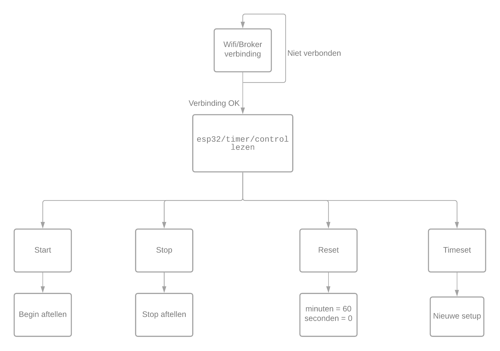
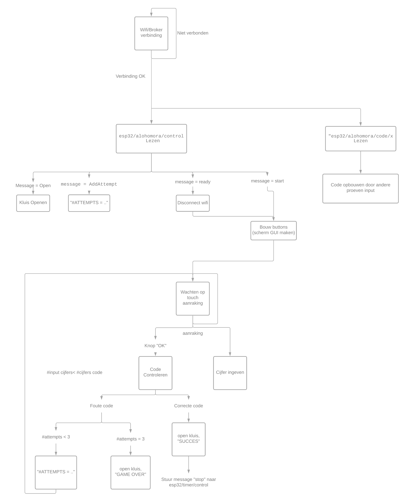

# Inhoud 
- [Opmerkingen](#Opmerkingen)
  - [Broker](#Communicatie)
  - [Timer](#Timer)
  - [Touchscreen](#Touchscreen)
- [Code](#Code)

# Opmerkingen

## Timer
De timer code kunnen we eenvoudig terugbrengen tot volgende flowchart.

De gebruikte code is [hier](https://github.com/Project-ES-20-21/Timer/blob/main/src/main.cpp) terug te vinden

## Touchscreen
De touchscreen code kunnen we eenvoudig terugbrengen tot volgende code.

# Code
