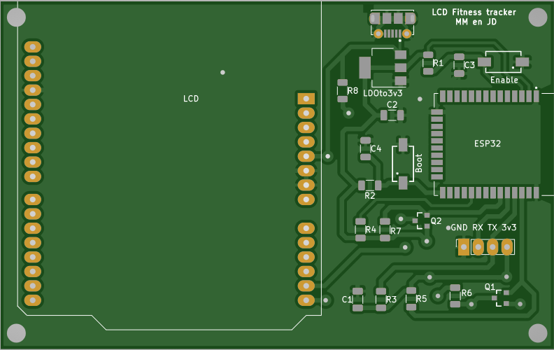

# Hardware

## Inhoud
- [Kettlebell](#Kettlebell)
- [LCD](#LCD)
## Kettlebell
De hardware van dit deel van de puzzel bestaat uit twee delen. 
Het eerste deel bestaat uit een gewicht waarmee de fitness oefeningen worden uitgevoerd. 
In dit project wordt gebruik gemaakt van een kettlebell van 4kg.

 

Het tweede deel van de hardware is de PCB die de oefeningen meet. Een eerste belangrijke component die we terug vinden op de PCB is een esp32. Deze zal worden gevoed met een compacte lipo batterij die een spanning van 3,7 volt levert. Aangezien de esp32 werkt op een spanning van 3,3 volt zal hiertussen een LDO (AMS1117-3.3) geschakeld worden die de spanning omzet naar 3,3 volt. Een tweede belangrijke component is de bewegingssensor. Hiervoor hebben we de MPU-9250 gebruikt. Deze heeft een voeding van 3,3 volt - 5 volt nodig en kan dus rechtstreeks aangesloten worden op de 3,3 volt van de esp (pin vcc). De GND van de sensor kan ook gewoon aan de ground van de esp32 aangesloten worden. Verder moeten ook nog de SCL- en SDA-pin aan de esp32 verbonden worden. Over deze lijnen worden respectievelijk het kloksignaal en de data uitgewisseld. Naast deze twee belangrijke componenten, zijn ook nog twee componenten voorzien die handig zijn bij het gebruik van de PCB: een buzzer en een extra drukknop. De + zijde van de buzzer is verbonden met pin 5 van de esp32 en de - zijde met de ground. De extra drukknop is aan de ene kant aangesloten op de 3,3 volt van de esp32 en aan de andere kant op pin 15 van esp32 en via een weerstand van 10kΩ aan de ground. Over deze knop staat ook een condensator van 100nF die zorgt voor de debouncing van de knop. Naast deze componenten zijn ook enkele componenten voorzien voor het programmeren van de esp32.  Er is een pinheader met 4 pinnen aanwezig. Op twee pinnen worden de voeding en de GND aangesloten, op de andere twee worden de RX en TX aangesloten. Ook zijn een enable en boot knop aanwezig die beide voorzien zijn van een condensator zoals de extra knop die eerder werd besproken. Enkele van deze componenten moeten echter ook ontkoppeld worden. Voor de esp32 en de MPU-9250 wordt dit gedaan met een condensator van 100nF en voor de LDO wordt dit gedaan met een condensator van 10µF. Voor de rest zijn nog een paar pull up weerstanden van 4,7 kΩ voorzien. Voor verdere details en de precieze aansluiten wordt verwezen naar de Kicad-files.
## LCD
Bij de hardware van de LCD gebruiken we een esp32 dat gevoed wordt door een powerbank. Hiervoor hebben we dus ook een micro usb ( van het type 105017-1001) met een LDO (AMS1117-3.3) dat spanning van 5V omzet in 3,3V. De LDO wordt ontkoppeld met een condensator van 10µF. De esp32 wordt ontkoppeld met een condensator van 100nF.
Aan ingang drie en 25 worden respectievelijk de enable-en bootbutton geplaatst en weerstand van 4,7kΩ die van de 3,3V komt. Voor elk van deze  knoppen gebruiken we ook een condensator van 100 nF om te debouncen. We voorzien ook een pinheader met 4 pinnen om te programmeren. RX en TX worden verbonden met 2 van deze pinnen. De andere 2 dienen dan als massa en 3,3V. Als LCD werd een Adafruit LCD shield gebruikt. Deze werkt op 5V en aangezien deze aangestuurd wordt door de esp32 dat op 3,3V werkt, moeten we deze signalen ,die via i2c worden verstuurd, omzetten naar signalen van 5V via een level shifter. Deze kunnen gemaakt worden met 1 n-channel mosfets en 2 weerstanden van 10kΩ. De LCD zelf wordt rechtstreeks gevoed vanuit de micro usb met 5V. Voor verdere details van de schakeling wordt aangeraden om naar Kicad-files te kijken. De PCB van de LCD ziet er als volgt uit:

Het volledige project in Kicad van de LCD is terug te vinden [hier](https://github.com/FitnessTrackerpuzzle/PCB_LCD).
