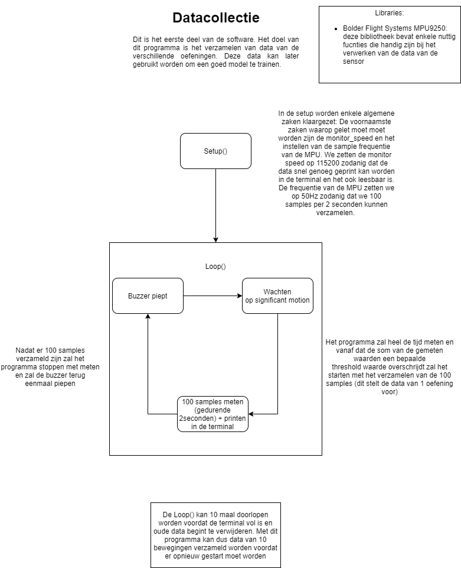
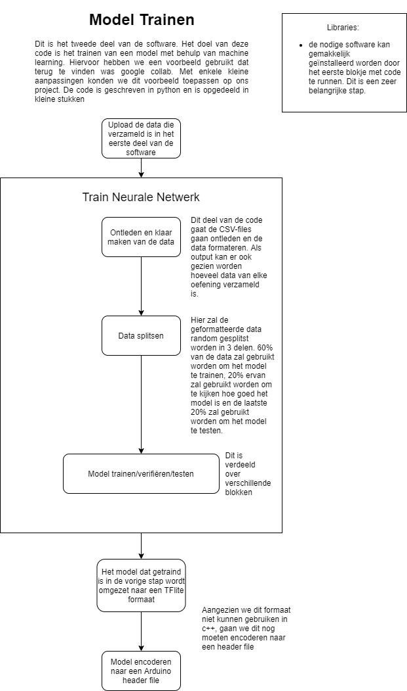
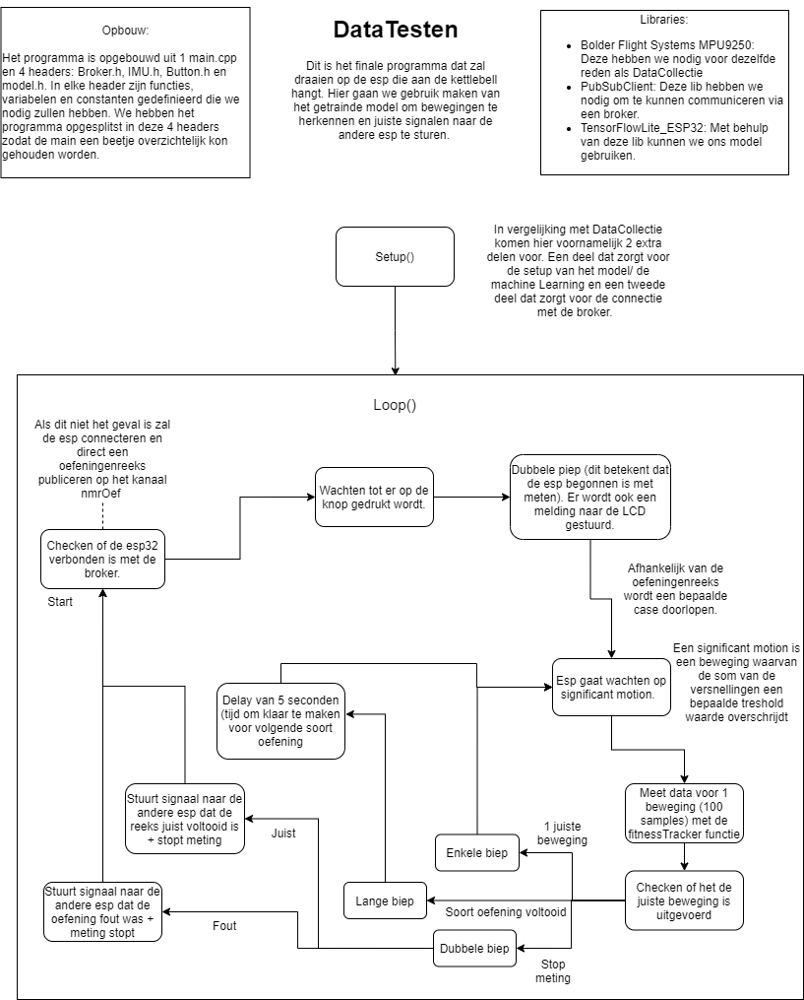

# Software

## LCD
In onderstaande figuur is de flowchart van software van de LCD gegeven. Voor de volledig code zie deze [link](https://github.com/FitnessTrackerpuzzle/CodeLCDmetMQTT-finaal-.git).
 

## Machine learning
### Data verzamelen
In onderstaande figuur is de flowchart van software om data te verzamelen gegeven. Voor de volledige code zie deze [link](https://github.com/FitnessTrackerpuzzle/CodeDataCollectie-finaal-).

### Model trainen
In onderstaande figuur is de flowchart van software om een model te trainen gegeven. Voor de google colab met de python code zie deze [link](https://colab.research.google.com/drive/1n9D9fKCJZdnTZDBaNA14b6IgqPN8YrN2).

 

## Kettlebell
In onderstaande figuur is de flowchart van software van de Kettlebell gegeven. Voor de volledig code zie deze [link](https://github.com/FitnessTrackerpuzzle/CodeKettlebellmetMQTT-finaal-).

