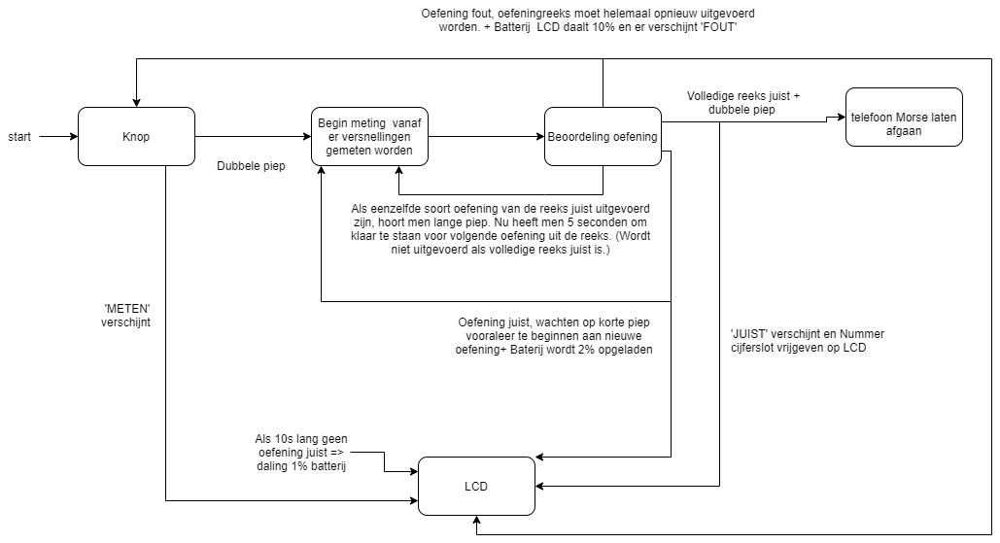

# Fitnesstracker

## Inhoud

- [Algemeen](#Algemeen)
- [Blokschema](#Blokschema)
- [Communicatie](#Communicatie)
- [Opstelling](#Opstelling)
- [Error Handling](#Error-Handling)

## Algemeen
De fitnesstracker heeft eigenlijk twee belangrijke functies. Een eerste die ervoor zorgt dat de kamer voorzien wordt van ‘elektriciteit’ dat voorzien wordt vanuit een virtuele batterij. Wanneer deze batterij niet opgeladen is, kunnen de andere puzzels niet worden uitgevoerd. De spelers kunnen deze opladen door juiste oefeningen te doen. Één juiste oefening resulteert in een kleine stijging(2 à 3%) van de batterij. Deze batterij wordt weergegeven op een LCD samen met een oefeningenreeks, dat bestaat uit een combinatie van verschillende oefeningen en tenslotte extra informatie voor de spelers. De oefeningenreeks kan teruggevonden worden op de poster dat ergens in de kamer is geplaatst. 

De andere belangrijke functie van de fitnesstracker is het vrijgegeven van een nummer van het digitaal cijferslot en het laten rinkelen van de telefoon van de puzzel morsecode. De spelers kunnen dit realiseren door de een volledige oefeningenreeks correct uit te voeren. Om zo een volledige reeks uit te voeren moeten de spelers eerst op de knop aan de kettlebell drukken, waarbij er een dubbele piep weerklinkt. Dit wil zeggen dat de esp32 aan de kettlebell klaar is om te meten. Op de LCD verschijnt er nu ook ‘Meten’. Zolang de kettlebell relatief stil gehouden wordt zal deze nog niet beginnen meten. Pas kort nadat men de beweging effectief inzet zal deze beginnen te meten. De spelers moeten één enkele beweging binnen de 2 seconden uitvoeren. Pas bij de volgende enkele korte piep mogen de spelers een volgende beweging beginnen. Dit process gaat door totdat men ofwel een lange piep  of een korte dubbele piep hoort. Een lange piep wil zeggen dat de spelers 5 seconden hebben om zich klaar te maken voor de volgende oefening soort binnen de oefeningenreeks. Na de 5 seconden zal een korte piep weerklinken, wat wil zeggen dat men opnieuw de oefening mag beginnen. 

Een dubbele piep wil zeggen dat de serie juist of fout werd uitgevoerd. Welke van de twee het is zal worden weergegeven op de LCD. Als deze fout werd uitgevoerd zal men de reeks vanaf nul moeten herbeginnen door weer op de knop te duwen en er zal 10% van de batterij afgetrokken worden. Als deze juist is zal men een cijfer van het cijferslot zien verschijnen in de rechterbovenhoek van de LCD. Tevens zal er ook een signaal naar de broker gestuurd worden dat de telefoon van morsecode mag beginnen rinkelen.

## Blokschema

## Communicatie
Alle communicatie verloopt via de broker. De gebruikte channels zijn:
- "esp32/fitness/nmrOef" om het nummer van de oefeningenreeks door te geven
- "esp32/fitness/control" wordt gebruikt om alles te resetten (“0”), te stoppen (“1”) en te starten(“2”), batterij leeg (“3”) en batterij niet leeg (“4”).
- "esp32/fitness/OKmessage" wordt gebruikt om van de kettlebell naar de LCD te laten weten of de oefening juist is of niet.
- "esp32/fitness/LCDmessage" stuurt door in welke toestand de esp aan de kettlebell zich bevindt.
- "esp32/fitness/telefoon" zal gebruikt worden om aan morse te laten weten dat de telefoon mag afgaan.
- "esp32/Alohomora/code1" zal gebruikt worden om het eerste cijfer van het cijferslot door te sturen.
- "esp32/fitness/request" wordt gebruikt om een cijfer van de oefeningenreeks op te vragen.
## Opstelling
Voor fitnesstracker wordt er best een plaats voorzien waarbij de spelers voldoende ruimte hebben om de oefeningen uit te voeren. De LCD zou idealiter in zicht moeten zijn terwijl men de oefening uitvoert. De poster kan men hangen in zicht van de spelers of buiten het zicht als men het iets moeilijker wil maken. Als extra kan er een matje voorzien worden waarop de kettlebell kan rusten zodat de vloer niet beschadigd geraakt.
## Error handling
- Een mogelijke fout is dat een juiste beweging niet goed gekeurd wordt. Aan dit probleem valt niet veel te doen. De enige oplossing is de reeks opnieuw beginnen en de        oefeningen nog duidelijker proberen uitvoeren.
- Een ander mogelijk probleem kan zijn dat het LCD scherm niet oplicht. Dit zal dan hoogstwaarschijnlijk te wijten zijn aan het feit dat de powerbank plat is of slecht contact maakt met het scherm. 
- Een gelijkaardig probleem kan optreden bij de kettlebell. Wanneer deze niet meer wil beginnen met meten (de buzzer piept niet als er op de knop gedrukt wordt), dan kan dat erop wijzen dat de lipo batterij plat is. 

