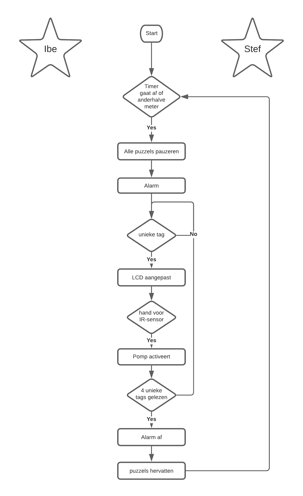

# Ontsmetting

## Algemene beschrijving

Wanneer de onderzoekers te dicht bij elkaar gekomen zijn, is er een risico op besmetting. De personen in kwestie zullen bij een te nauw contact zorgvulidg de handen moeten ontsmetten. Werk kan dus maar verder gezet worden wanneer dit gebeurd is.
Via een slimme ontsmettingsdispenser moet er bijgehouden worden wie reeds ontsmet is en wie niet. Op deze manier kan het onderzoek (puzzels) op een veilige manier verlopen. Dit wordt gedaan via een nfc badge die de besmette onderzoekers moeten scannen om ontsmettingsalcohol te verkijgen. Hierdoor kan men met zekerheid zeggen dat de juist personen ontsmet zijn. De dispenser werkt volledig zonder fysiek contact aangezien deze via een afstandssensor kan bedient worden.

##### Blokschema:

In onderstaand blokschema is het algemeen verloop van de opstelling geschetst.

## Onderdelen

### Handdetectie

Voor het detecteren van een hand maken we gebruik van een IR breakbeam sensor. Deze digitale sensor zal een hoog niveau geven als het IR-signaal van de zender invalt op de ontvanger. Door de twee modules naast elkaar te plaatsen kunnen we gebruik maken van reflectie om een object te detecteren, het uitgezonden IR-licht wordt door de aanwezigheid van een hand gereflecteerd naar de ontvanger. Hierdoor is slecht langs één kant een module vereist. Door de sensoren naast elkaar te plaatsen kan een signaal bekomen worden wanneer een hand op ongeveer 10 cm van de sensor wordt geplaatst. 

### Identificatie

De identificatie gebeurt aan de hand van een nfc tag. De id's worden opgemeten en opgeslagen. Deze worden gegeven in een array. De functie hexToString() is nodig om deze in een String te kunnen opslaan. De aanwezigheid van een geldige, niet eerder gebruikte tag zal nodig zijn om de pomp in werking te stellen.

### Pompen

Voor het oppompen maken we gebruik van een mini pomp. We probeerden eerst via een servo een ontsmettingspomp fysiek in te duwen. De servo was hier echter niet krachtig genoeg voor waardoor er een krachtigere servo nodig was. We besloten echter om een elektrisch pompje te gebruiken dat efficiënter werkt dan een servo. Het gebruik van een nozzle is nodig om de ontsmettingsalcohol te vernevelen. Deze zal door ons ge-3D-print worden.

### LCD scherm

Een LCD scherm geeft aan hoeveel personen zich al ontsmet hebben. 

### RGB Led

Een RGB led zal een visuele indicatie vormen van de correctheid van de NFC-badge. Wanneer een van de wetenschappers zijn handen al ontsmet heeft en terug met dezelfde badge aan ontsmetting probeert te raken zal dit een rode led doen branden die aantoont dat de badge niet correct is. Wanneer de badge wel correct is en er ontsmettingsmiddel gepompt wordt zal er een groene led branden.

### Uitbreiding met waterlevelindicator 

Wanneer de vloeistof in de dispenser op dreigt te raken zorgt een water level sensor er voor dat er een melding verstuurd wordt.