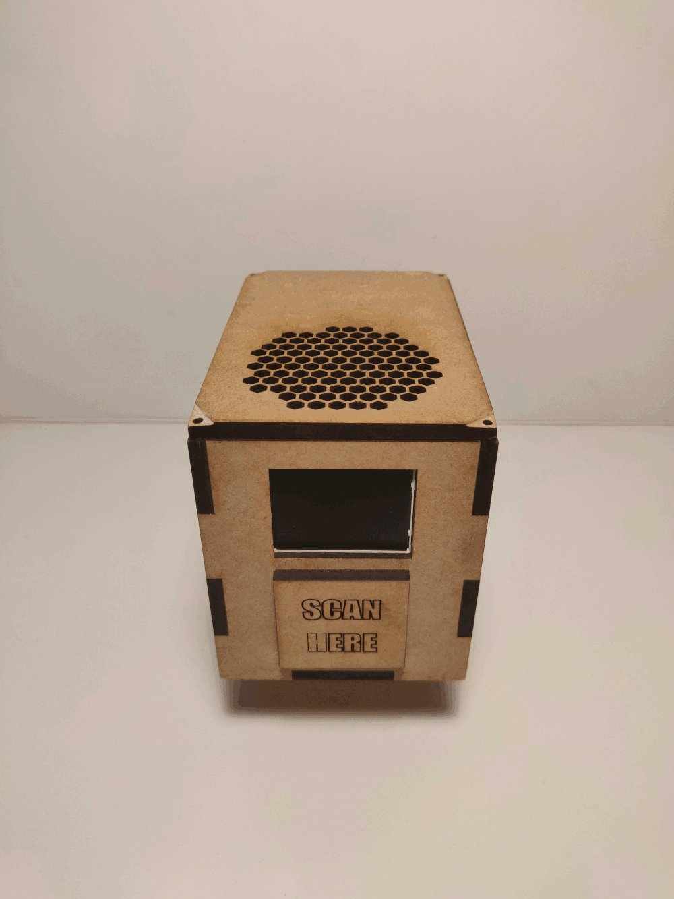

De PCB werd ondergebracht in een uniek ontworpen case. Binnen deze case bevinden zich de PCB, het reservoir dat ontsmettingsmiddel bevat, de powerbank en alle externe onderdelen. Bij het ontwerpen hiervan werd extra aandacht gegeven aan het compact zijn en de gebruiksvriendelijkheid. Vooraan de case bevinden zich het scherm en een aanduiding waar de RFID-tags gescand moeten worden. Achter deze aanduiding zit de NFC module. Aan de onderkant bevinden zich de IR-sensoren en de uitgang van de darm van de ontsmettingspomp. Op deze manier kan men in één beweging een hand scannen en ontsmetting verkrijgen. Het lagere gedeelte bevat het reservoir en zorgt ervoor dat de pomp zich lager bevindt dan het uiteinde van de darm. Dit voorkomt dat het reservoir in één keer leegloopt door de wet van verbonden vaten. Ten slotte is in het dak van de case een rooster aanwezig waar de speaker gemonteerd is.

Binnenin de case bevinden zich houten rails waartussen een plankje met de PCB bevestigd kan worden. Op deze manier is het gemakkelijk om de PCB te verwijderen indien nodig. 

Deze puzzel zal bevestigd worden aan de kolom in het centrum van de ruimte. De centrale ligging van deze kolom zal ervoor zorgen dat de onderzoekers snel en eenvoudig tot bij de dispenser kunnen raken. De bevestiging aan de kolom gebeurt aan de hand van enkele riemen die ronde de kolom kunnen gespannen worden. De behuizing werd via een laser cutter uit MDF gesneden. Het ontsmettingsmiddelreservoir werd gefabriceerd uit PLA materiaal met een 3D printer. Gezien de complexe vorm van het mechanisme die voorkomt dat de pomp gaat drijven was dit de efficiënste manier van werken. PLA is waterdicht waardoor geen extra waterdichting nodig was.

Het ontwerp werd via solidworks ontwikkeld. De files hiervan bevinden zich onder volgende link:
(https://github.com/Ontsmettinator3000/casing)
