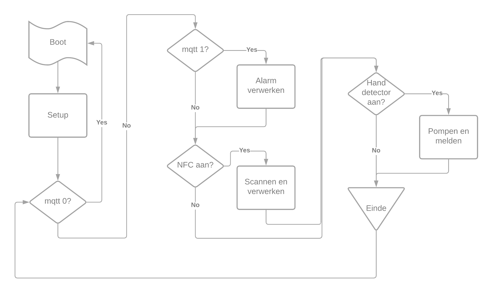

# Software
- [Setup en main loop](#setup-en-main-loop)
- [Config](#config)
- [IR sensor](#ir-sensor)
- [Scherm](#scherm)
- [Login](#login)
- [Monitor](#monitor)
- [MQTT](#mqtt)
- [NFC](#nfc)
- [Speaker](#speaker)

Het gehele project wordt bestuurd via een ESP32 module. Deze module kan geprogrammeerd worden via Arduino flavoured C en C++. Alle geschreven software is beschikbaar in de [algemene repository](https://github.com/Ontsmettinator3000/main) van onze [organisatie](https://github.com/Ontsmettinator3000). Bij de start van de ontwikkeling kozen we er voor om het geheel "modulair" maken. Hierbij splitsten we de verschillende onderdelen op in aparte klasses. Dit deden we om de main loop leesbaar en overzichtelijk te maken. Ook is het hierdoor makkelijk om dingen uit te breiden of te overbruggen bij foutieve werking.


## Setup en main loop

Zoals elk Arduino-programma, zal ook onze code lopen vanuit een loop. Hierbij zal eenmaal de setupmethode overlopen worden alvorens de loop te starten. In de setup zullen we de verschillende onderdelen juist configureren. Zo zullen we de wifi en MQTT verbinding instellen, alsook enkele pinModes definiëren. Ook de OTA connectie wordt hier ingesteld.

De main loop is een vertaling van de [algemene flowchart](index.md#Blokschema) in code. Eerst en vooral zullen we loop functies hebben voor verschillende klasses. Deze zullen zeer frequent opgeroepen worden. Vaak zullen deze functies bepaalde informatie ophalen of dingen updaten. Hierna zullen we eerste test doen. Merk op dat in deze fase alle andere onderdelen uitgeschakeld zijn door de setup. Indien een alarm ontvangen is, zullen we het scherm updaten en de NFC handler inschakelen. We bevinden ons nu in fase twee van het proces. Hierbij zal een gescande kaart de login functie oproepen. Deze zal testen of de tag al dan niet correct is en eventueel reeds geregistreerd. Als dit onderdeel doorlopen is, rest er nog enkel de alcohol te laten lopen. Dit zal gebeuren nadat de scanner een hand geregistreerd heeft via de scanner klasse. Indien deze cyclus doorlopen is voor iedere besmette speler, zal een OK signaal verzonden worden naar de broker.



Doorheen de code mag er geen gebruik gemaakt worden van blocking code, deze zal namelijk zorgen voor een vertraagde/foute OTA. Het gebruik van millis() bij tijdsmetingen is dus vereist. Ook zal de code niet blokkeren bij een fout in de setup. Er zal dus steeds vanuit de setup naar de loop gegaan worden, onafhankelijk of deze voorafgaande setup succesvol was. Hierdoor is programmeren via WiFi op elk moment mogelijk.

## Config

Tijdens het hele ontwikkelingsproces moeten er veel parameters bepaald worden. We kozen ervoor om alle instellingen te centraliseren in één document. Hierdoor konden we in één oogopslag alle instellingen bekijken en snel aanpassen. Dit zorgt er ook voor dat we verschillende parameters in meerdere klasses tegelijk kunnen gebruiken zonder deze meerdere keren te moeten definiëren.

## IR sensor

De IR sensor klasse is relatief klein. In de eerste versie van de software, maakten we gebruik van interrupts. Later bleken deze in onze toepassing niet stabiel genoeg. Hierdoor schakelden we over naar een if() statement in de loop. Deze zal pollen of de sensor al dan niet geactiveerd is. Later bleek de instabiliteit eerder te liggen aan het omgevingslicht. We schakelden niet meer terug naar interrupts. De polling gebeurt in de loop functie van de klasse. Indien de sensor (softwarematig) ingeschakeld wordt, zal bij de detectie van een hand de boolean handDetected op true gezet worden. Deze kan men in de main loop gebruiken als paramater om te pompen. Deze kan men ophalen op volgende manier:
```c
if (handDetector.handDetected)
  {
      ...
  }
```

### Functies
De klasse heeft enkele kleine functies.
##### setup()
De setup functie dient aan het begin van de code opgeroepen te worden. Deze zal zorgen voor de juiste pinmode van de inputpin.
##### enable() en disable()
Via deze twee functies kan men de sensor in en uitschakelen. Na het uitschakelen van de sensoren zullen geen handen meer gedetecteerd worden tot deze weer is ingeschakeld.
##### loop()
Functie die regelmatig dient opgeroepen te worden. Deze zal de handdetectie vertalen in een boolean. Indien een hand gedetecteerd wordt, zal deze onthouden worden tot de sensor wordt uitgeschakeld. Meerdere keren handen na elkaar scannen heeft dus geen zin indien er tussenin niet wordt uitgeschakeld.


## Scherm

Voor de visuele indicatie maken we gebruik van een LCD scherm. Dit scherm zal communiceren via SPI. Deze communicatie wordt softwarematig verwezenlijkt door enkele libraries. We zullen steeds rechtstreeks gebruik maken van de Adafruit_ILI9341 library. Deze is speciaal ontwikkeld voor het type scherm dat we gebruiken. Het pakket zal gebruik maken van de algemene Adafruit_GFX library voor het genereren van de beelden.

### Functies
Het gebruik van de Adafruit bibliotheek zal het afbeelden van vormen en figuren sterk vergemakkelijken. Er verschillende functies in de Scherm klasse, die verantwoordelijk zijn voor het tekenen/afbeelden van bepaalde "scenes". 
##### setup()
Moet worden opgeroepen in het begin van de code om het scherm te configureren.

##### loop()
Functie die tijdens het lopen van het programma geregeld moet opgeroepen worden. Deze wordt gebruikt voor een niet blokkerende timer.

##### paintCross(int positie)
Hiermee kan men de indicator voor een personen op een kruisje zetten. Dit betekent dat de persoon niet ontsmet is. Het positie argument zal de plaats bepalen waar het icoon afgebeeld wordt. De positie is een int van 0 tot en met 3. De plaatsing is als volgt:<br>
>>

##### paintCheck(int positie)
Deze functie zal checks (vinkjes) afbeelden bij bepaalde personen. De plaatsing van de icoontjes zal op dezelfde manier als paintCross() gebeuren.
##### paintGevaar()
Paint gevaar zal een gevarendriehoek centraal op het scherm afbeelden. Hierbij wordt gebruikt gemaakt van de ingebouwde shape functies van de Adafruit library. Hierdoor zal het gebruikte geheugen beperkt worden.
##### clear()
Hierdoor zal het scherm volledig overtrokken worden met een witte kleur. Let op: een clear zal het scherm niet uitschakelen, indien energieverbruik beperkt moet worden maakt men best gebruik van de enable functionaliteit van het scherm.
##### validTag()
Functie die het scannen van een geldige tag zal visualiseren.
##### clearTag()
Functie die de bovenstaande visualisatie wist.


## Login
De registratie en authenticatie van de verschillende (besmette) spelers gebeurd via deze klasse. Deze personen worden geïdentificeerd via een nfc tag. Deze tag heeft een uniek id dat kan worden uitgelezen. De geldige tags zijn gekoppeld aan een nummer vanaf 0 tot en met 3. De unieke id's van de tags zijn opgeslagen in een extern document genaamd "*validTags.h*". Dit document staat in de include folder en heeft volgende structuur:
```cpp
int length = 4;
String tags[4] = {"0X12 0X34 0X56 0XC78 0X00 0X00 0X00",
                  ...
                  "0X9A 0XBC 0XDE 0XF0 0X00 0X00 0X00"};
```
De int `length` zal het aantal tags bijhouden om achteraf makkelijk alle tags te kunnen overlopen. De array van Strings `tags[]` zal de id's van de tags bijhouden. Men kan hierbij het aantal tags aanpassen. Het nummer van de tag (en bijhorend id) zal bepaald worden door de index van id. Indien de id van een bepaalde tag als eerste in de array staat, zal deze dus id 0 krijgen.

Het is belangrijk dat elke id uit 7 hexadecimale delen bestaat, gescheiden door een spatie. Indien de tag een korter id gebruikt, wordt dit aangevuld met 0X00. Ook moet zowel de X als de letters van de getalwaarde (A tot F) van het hexadecimale getal steeds in hoofdletter geschreven worden.

### Functies
De login klasse maakt gebruik van verschillende functie om de personen te registeren en bij te houden.
##### setId(String ids)
Deze functie zal de mee gegeven id's (nummers) registreren als besmet. De nummers zijn zoals hierboven vermeldt, gekoppeld aan een bijhorende tagId. De mee gegeven String wordt als volgt opgemaakt: 
```cpp
"123" //personen 1, 2 en 3 zijn dus besmet
```
Hierbij wordt elke individueel karakter van de string beschouwd als een tag nummer. Let op dat deze String enkel cijfers bevat. Er zijn dus maximaal 10 (0 - 9) nummers mogelijk.
##### validate(String id)
###### returns: `boolean`
Om de de gescande tags te testen op eventuele besmetting, kan men deze functie gebruiken. Via bovengenoemde functie [`setId(String ids)`](#setidstring-ids) kan men de besmette tagnummers registreren. Deze functie zal het meegegeven tagId opzoeken en aan de hand van de resulaten een boolean terug geven. Indien deze persoon niet geregistreerd werd, zal deze `false` returnen en `true` indien dit wel gebeurde. Let op, deze id zal niet als ontsmet gezien worden na het uitvoeren van de functie. Indien deze functionaliteit gewenst is, kan men gebruik maken van [`login(String id)`](#loginstring-id).

##### login(String id)
###### returns: `boolean`
Bij het checken van bepaalde tag id's, kan het handig zijn om direct ook te registreren dat deze persoon ontsmet is. Dit is mogelijk met deze functie. Als argument wordt een String met een bepaald tag id gevraagd. Indien deze in de lijst met besmette id's aanwezig is, zal deze uit de lijst geschrapt worden en `true` terug gegeven worden. Indien deze tag niet gekend is, zal `false` terug gegeven worden. Deze functie zal gebruik maken van [`validate(String id)`](#validatestring-id) voor het opzoeken van de tag.
##### getUserCount()
###### returns: `int`
Deze functie zal het aantal besmette speler terug geven.


##### reset()
Hierdoor zullen alle geregistreerde besmette spelers gewist worden uit de lijst.


## Monitor
Het debuggen van een microcontroller is vaak moeilijk. Men kan berichten uitschrijven via de Seriële monitor. Echter is de seriële monitor niet altijd beschikbaar. Hiervoor is steeds een bekabelde USB verbinding nodig. Deze klasse zal dit probleem oplossen. Via een statische methode, kan je zowel langs seriële monitor als mqtt de berichten uitlezen. In tegenstelling tot andere klassen, hoeft er geen object gemaakt te worden. Dit zal ervoor zorgen dat we geen parallelle objecten aanmaken of de code complexer maken door pointers naar een Monitor object te bij te houden.

### Functies
De monitor maakt slechts gebruik van twee functies. Deze moeten statisch zijn om aanmaken van een object te vermijden. Deze functies worden, na het includeren van de juiste header file, op volgende manier aangesproken:
```cpp
Monitor::println("Hello world!");
```

Indien men extra functionaliteit wilt toevoegen, kan in de `println()` methode altijd extra dingen toegevoegd worden. Zo is het mogelijk gebruik te maken van een scherm om de berichten te laten zien. Dit bleek in het geval van de Ontsmettinator niet handig te zijn.

## MQTT
De communicatie van het gehele systeem gebeurt via MQTT. Dit protocol werkt volgens het publish-subscribe principe. Hierbij wordt een broker gebruikt die dienst doet als centrale server.
#### Functies
##### setup()
Basis functie die connectie met Wifi en MQTT server maakt. Voor de connectie met het internet maakt deze gebruik van `setupWifi()`. De MQTT verbinding zal dan weer gebeuren via `reconnect()` Ook zal de callback functie gekoppeld worden aan de MQTT verbinding. Indien deze setup geslaagd is, zal het IP-adres van de ESP32 op het daarvoor voorziene MQTT kanaal gepost worden. Hierdoor is het eenvoudiger om te programmeren via OTA. Dit bericht is retained, het meest recente IP-adres zal dus altijd zichtbaar zijn.
##### setupWifi()
Deze methode zal een Wifi verbinding opstellen. Hierbij is het mogelijk om drie verschillende Wifi netwerken in te stellen (via config.h). De methode zal nu eerst en vooral met netwerk 1 proberen verbinden. Indien deze connectie niet gelukt is, zal er overgeschakeld worden naar het volgende netwerk. Op deze manier kan de opstelling zonder problemen verplaatst worden naar andere plaatsen (bv. thuis) waar een ander netwerk aanwezig is. Let op, de controller zal pas na 10 seconden overschakelen naar het volgende netwerk. Het kan dus tot 30 seconden duren voor men met het netwerk verbonden is. Indien er geen connectie tot stand is gebracht, zal de led een foutcode geven. In dit geval is dit volgende  sequentie:  (lang aan, kort uit)
##### reconnect()
Via deze functie kan de MQTT verbinding opgesteld worden. Deze kan ook gebruikt worden om de connectie te testen. Indien de controller verbonden is met de server, zal de methode niks doen. Als de verbinding verbroken is zal deze opnieuw proberen verbinden. Als reconnect() regelmatig wordt opgeroepen (in de loop), is er zo goed als altijd een verbinding met de MQTT server. Ook hier wordt gebruik gemaakt van een led error code. Indien de MQTT verbinding verbroken is, zal de sequentie het volgende zijn: (kort aan, lang uit)

##### callback(char *topic, byte *message, unisgned int length)
Deze functie wordt opgeroepen door de MQTT handler als er een bericht ontvangen wordt op een bepaald kanaal. Deze callback functie behoort tot huidige klasse, echter zal de MQTT handler een std function callback verwachten. Een conversie van `MQTT::callback()` naar `std::function()` is vereist. Dit kan op volgende manier gebeuren:

```cpp
using std::placeholders::_1;
using std::placeholders::_2;
using std::placeholders::_3;
client.setCallback(std::bind(&MQTT::callback, this, _1, _2, _3));
```
De bind methode zal de `MQTT::callback()` forwarden naar een `std::function()` waarbij de placeholders gebruikt worden om de argumenten in te vullen.
##### loop()
De loop functie zal regelmatig moeten overlopen worden. Deze zal zorgen voor een stabiele verbinding. Indien de connectie verloren is, zal men opnieuw proberen verbinden. Ook wordt hier het laatste MQTT bericht opgehaald.

##### getCurrentSignal()
###### returns: `String`
Geeft het huidige ontvangen MQTT bericht terug.


##### getLastSignal()
###### returns: `String`
Geeft het vorige ontvangen MQTT bericht terug.

##### setOK()
Hierdoor zullen alle andere onderdelen van de escape room op de hoogte gebracht worden dat iedereen ontsmet is.

##### println(String bericht)
Hiermee kan men prints doen via MQTT. Deze worden dan op het monitor kanaal geplaatst. Deze functie wordt gebruikt in de monitor klasse.

## NFC
Voor het identificeren van verschillende spelers, maken we gebruik van NFC-tags. Deze kunnen uitgelezen worden door met een tag in de buurt van de sensor te komen. De lezer maakt gebruik van I²C in combinatie met interrupts.

### Functies
##### setup()
Deze dient zoals alle andere setup functie aan het begin van de code opgeroepen te worden. Hier zal de verbinding met de scanner tot stand gebracht worden. Indien deze verbinding niet geslaagd is, zal hier ook een error led blink zijn. Deze gaat als volgt:  (kort aan, kort uit)

##### startListeningToNFC()
Indien men wilt beginnen met lezen van tags, moet deze functie opgeroepen worden. Hierbij zullen de interrupt indicatoren gerest worden.

##### handleCardDetected()
###### returns: `String`
Bij het scannen van tags kan men de huidige tag opvragen. Dit zal gebeuren als een interrupt ontvangen wordt. Hiervoor maakt men gebruik van deze functie. Indien de tag succesvol gescand is, zal een String met het tag id terug gegeven worden. Initieel staat het resultaat opgeslagen in een array van hexadecimale getallen. Door het gebruik van `hexToString()` kan man deze array omzetten in een String.

##### getCardDetected()
###### returns: `String`
In de main loop wordt gebruik gemaakt van deze functie voor het lezen van tags. Deze zal `handleCardDetected()` gebruiken in combinatie met interrupts en enable values voor het verwerken van de metingen. Indien de sensor softwarematig is uitgescakeld, zal `"DISABLED"` terug gegeven worden. Anders wordt het gescande id terug gegeven.

##### hexToString(uint8_t *cardid)
###### returns: `String`
De methodes van de Adafruit NFC-klasse zullen een array van ints returnen. In de `validTags.h` worden de id's van de tags als Strings opgeslagen. Een conversie is dus nodig. Deze functie zet een array van ints om in een String.

##### enable() en disable()
Hiermee kan men de sensor softwarematig in- en uitschakelen.

## Speaker
Om de aandacht van de spelers te trekken, wordt er gebruik gemaakt van een speaker. Hier kan men verschillende geluiden afspelen. Het audiofragment wordt opgeslagen met een `.wav` indeling. Dit `.wav` bestand wordt geëxporteerd als een *C*-array. Deze array wordt in `SoundData.h` opgeslagen. Deze file bevindt zich in de include folder. Hierbij zijn enkel instellingen vereist:

| Aanbevolen sample rate     | 16000 Hz   |
| Maximale lengte           | ongeveer 20 seconden  |
| Indeling | Unsigned 8-bit PCM           |

Voor het opnemen en verwerken is [Audacity](https://www.audacityteam.org/) zeer handig. Het exporteren van de array uit de `.wav` file kan dan weer makkelijk gedaan worden met [HxD hex editor](https://mh-nexus.de/en/hxd/). Een gedetailleerde beschrijving is via [deze link](https://www.xtronical.com/basics/audio/dacs-for-sound/playing-wav-files/) terug te vinden.

### Functies
##### setup()
Aan het begin van de code moet deze opgeroepen worden.
##### loop()
De `loop()` moet regelmatig overlopen worden in de code.

##### play()
Deze zal het geluid van `SoundData.h` afspelen.