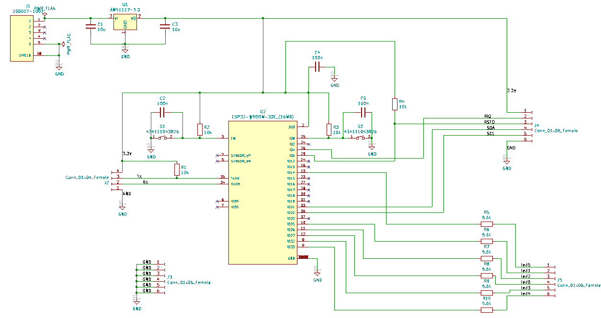
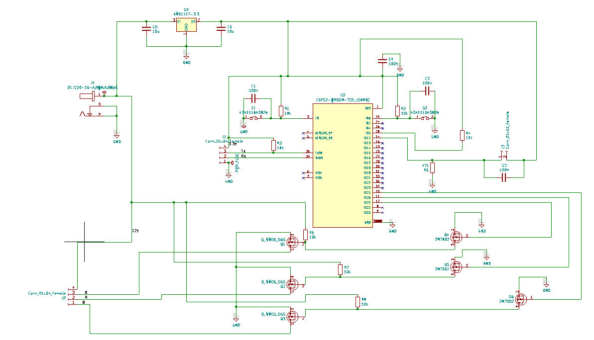

# Hardware

## Inhoud
- [Algemeen](#Algemeen)
- [ESP NFC](#ESP_NFC)
  - [Schema](#Schema)
  - [PCB](#PCB)
- [ESP Buttons](#ESP_Buttons)
  - [Schema](#Schema)
  - [PCB](#PCB)
- [ESP Ledstrip](#ESP_Ledstrip)
  - [Schema](#Schema)
  - [PCB](#PCB)

## Algemeen
De KiCad files horende bij de verschillende PCB-ontwerpen zijn [hier](https://github.com/Project-ES-20-21/General/tree/gh-pages/docs/Vaccintester/KiCad) te vinden.

## ESP NFC
### Schema
De centrale chip van deze PCB is een ESP32. Deze wordt aangestuurd met een voedingsspanning van 3.3V. Deze is afkomstig van een powerbank die via een micro-usb aangesloten is aan de PCB. Uit deze micro-usb komt 5V. Om deze om te zetten naar 3.3V wordt gebruik gemaakt van een LDO. Deze LDO wordt ontkoppeld met twee condensatoren van 10uF.

Om de ESP32 te kunnen flashen zijn er enkele componenten nodig. Er moeten twee drukknoppen aanwezig zijn. De ene is verbonden met de enable van de ESP32, de andere met IO0. Dit is de drukknop die het booten  mogelijk maakt. Beide drukknoppen worden gedebounced door een condensator parallel over de drukknop te plaatsen en ontkoppeld via weerstanden. Om via een computer te communiceren met de ESP32 zijn pinheaders nodig. Deze zijn verbonden met TX en RX van de ESP32. Via een UART bridge kan nu gecommuniceerd worden met de ESP32. 

Aangezien deze PCB zorgt voor het opstarten en tonen van de sequentie moet het mogelijk zijn om een NFC reader en enkele leds aan te sluiten aan de bijhorende ingangen van de ESP32. Helemaal rechts op het schema staan twee sets pinheaders. De bovenste van deze twee sets dient voor het aansluiten van de NFC reader. Zo moeten de uitgangen IRQ, RSTD, SDA en SCL van de NFC reader verbonden worden met enkele ingangen van de ESP32. Daarnaast is er ook een aansluiting met de voedingsspanning van 3.3V en een aansluiting met de ground. De onderste van de twee sets pinheaders maakt het mogelijk om enkele leds aan te sluiten. elk van deze leds is via een weerstand in serie verbonden met een bijhorende uitgang van de ESP32. Elk van deze uitgangen is gekoppeld aan een bepaalde kleur binnen de sequentie. Daarnaast is er nog een set van zes pinheaders die het mogelijk maken om de leds aan te sluiten op de ground.

### PCB
Na het maken van het schema kan het PCB-ontwerp aangemaakt worden. Het finale ontwerp van de PCB kan men zien op de foto's hieronder. De bovenste foto is de voorkant van de PCB, de onderste de achterkant.

## ESP Buttons
### Schema

### PCB

## ESP Ledstrip
### Schema

### PCB

