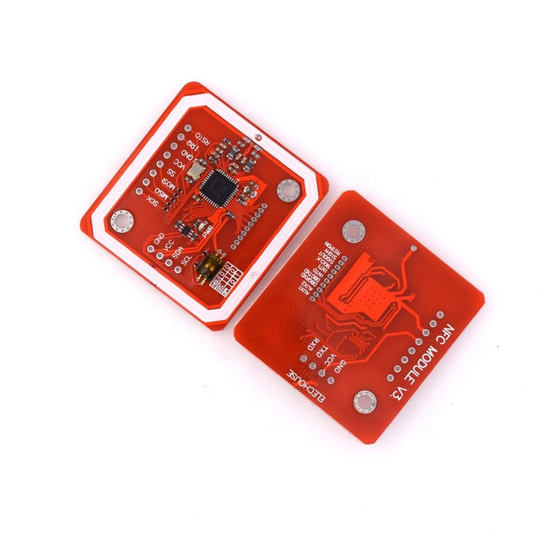
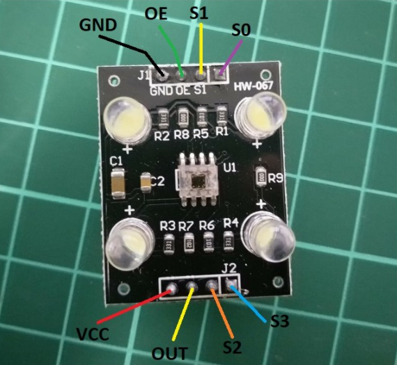

# Hardware

## Inhoud
- [Algemeen](#Algemeen)
- [ESP NFC](#ESP_NFC)
  - [Schema](#Schema)
  - [PCB](#PCB)
- [ESP Buttons](#ESP_Buttons)
  - [Schema](#Schema)
  - [PCB](#PCB)
- [ESP Ledstrip](#ESP_Ledstrip)
  - [Schema](#Schema)
  - [PCB](#PCB)

## Algemeen
De KiCad files horende bij de verschillende PCB-ontwerpen zijn [hier](https://github.com/Project-ES-20-21/General/tree/gh-pages/docs/Vaccintester/KiCad) te vinden.

## ESP NFC
### Schema
De centrale chip van deze PCB is een ESP32. Deze wordt aangestuurd met een voedingsspanning van 3.3V. Deze is afkomstig van een powerbank die via een micro-usb aangesloten is aan de PCB. Uit deze micro-usb komt 5V. Om deze om te zetten naar 3.3V wordt gebruik gemaakt van een LDO. Deze LDO wordt ontkoppeld met twee condensatoren van 10uF.

Om de ESP32 te kunnen flashen zijn er enkele componenten nodig. Er moeten twee drukknoppen aanwezig zijn. De ene is verbonden met de enable van de ESP32, de andere met IO0. Dit is de drukknop die het booten  mogelijk maakt. Om de ESP32 in flash mode te brengen moet de boot-knop ingedrukt worden en er terwijl kort op de enable-knop gedrukt worden. Beide drukknoppen worden gedebounced door een condensator parallel over de drukknop te plaatsen en ontkoppeld via weerstanden. Om via een computer te communiceren met de ESP32 zijn pinheaders nodig. Deze zijn verbonden met TX en RX van de ESP32. Via een UART bridge kan nu gecommuniceerd worden met de ESP32. 

Aangezien deze PCB zorgt voor het opstarten en tonen van de sequentie moet het mogelijk zijn om een NFC reader en enkele leds aan te sluiten aan de bijhorende ingangen van de ESP32. Helemaal rechts op het schema staan twee sets pinheaders. De bovenste van deze twee sets dient voor het aansluiten van de NFC reader. Hier wordt gebruik gemaakt van een HW-147 zoals weergegeven onder het schema. Zo moeten de uitgangen IRQ, RSTD, SDA en SCL van de NFC reader verbonden worden met enkele ingangen van de ESP32. Daarnaast is er ook een aansluiting met de voedingsspanning van 3.3V en een aansluiting met de ground. De onderste van de twee sets pinheaders maakt het mogelijk om enkele leds aan te sluiten. elk van deze leds is via een weerstand in serie verbonden met een bijhorende uitgang van de ESP32. Elk van deze uitgangen is gekoppeld aan een bepaalde kleur binnen de sequentie. Daarnaast is er nog een set van zes pinheaders die het mogelijk maken om de leds aan te sluiten op de ground.

### PCB
Na het maken van het schema kan het PCB-ontwerp aangemaakt worden. Het finale ontwerp van de PCB kan men zien op de foto's hieronder. De bovenste foto is de voorkant van de PCB, de onderste de achterkant.

## ESP Buttons
### Schema
Ook bij dit gedeelte van de puzzel is de centrale chip op de PCB een ESP32. Deze wordt opnieuw aangedreven met behulp van een powerbank die via micro-usb aangesloten is aan de PCB. Deze levert opnieuw 5V en wordt via een LDO omgezet naar de gewenste voedingsspanning van 3.3V. Ook hier is de LDO ontkoppeld door twee condensatoren van 10uF.

Om het flashen van de ESP32 mogelijk te maken worden hier dezelfde componenten en pinnen gebruikt. Er zijn twee knoppen nodig die gedebounced zijn en verbonden zijn met de enable en IO0 van de ESP32. TX en RX worden aan pinheaders gekoppeld om communicatie tussen een computer en de ESP32 mogelijk te maken.

Dit gedeelte van de puzzel maakt gebruik van een kleursensor. Deze is afgebeeld onder het schema. Elk van de uitgangen van de kleursensor wordt aangesloten op een afzonderlijke pin van de ESP32. Daarnaast is er nog een pin de verbonden is met de voedingsspanning van 3.3V en een pin die verbonden is met de ground. 

Aangezien de waarden die de kleursensor opmeet slecht doorgestuurd mogen worden nadat er op een knop gedrukt is, moeten er pinheaders voorzien worden op de drukknop op aan te sluiten. Deze drukknop is verbonden met IO12 van de ESP32. De drukknop wordt gedebounced door een condensator van 100nF parallel over de pinheaders te plaatsen. Daarnaast wordt deze ingang van de ESP32 nog ontkoppeld via  een weerstand.

### PCB
Na het maken van het schema kan het PCB-ontwerp aangemaakt worden. Het finale ontwerp van de PCB kan men zien op de foto's hieronder. De bovenste foto is de voorkant van de PCB, de onderste de achterkant.

## ESP Ledstrip
### Schema
Ook hier wordt opnieuw gebruik gemaakt van een ESP32 als centrale chip. Nu wordt deze niet aangedreven via micro-usb, maar via een DC-jack, namelijk een DCJ250. Via deze jack wordt 12V aangesloten op de PCB. Die 12V is nodig om de ledstrip te voeden. De ESP32 werkt echter op 3.3V. Deze wordt verkregen door opnieuw gebruik te maken van een LDO die ontkoppeld is via twee condensatoren van 10uF. 

Voor het flashen van de ESP wordt opnieuw van twee drukknoppen die gedebounced zijn gebruik gemaakt. Deze worden aangesloten op de enable en IO0 van de ESP32. Daarnaast worden RX en TX opnieuw verbonden met pinheaders om de UART bridge aan te sluiten.

Net zoals bij de buttons wordt IO12 gebruikt om een drukknop aan te sluiten. Dit gebeurt opnieuw via twee pinheaders die parallel geschakeld zijn met een condensator om de knop te debouncen. Daarnaast wordt de ingang van de ESP opnieuw ontkoppeld door gebruik te maken van een weerstand.

Het belangrijkste element van dit gedeelte van de puzzel is de ledstrip. Deze wordt aangestuurd door IO25, IO26 en IO27 van de ESP32. Elk van deze uitgangen van de ESP32 bepaalt één van de drie kleuren aanwezig in de ledstrip. Deze kleuren zijn groen, blauw en rood. Om de ledstrip correct te kunnen aansturen zijn zes n-mosfets nodig. De uitgangen van de ESP32 zijn eerst en vooral verbonden met de gate van een 2N7000 mosfet. De source is verbonden met de ground en de drain met de gate van een andere n-mosfet. Ook bij deze mosfet is de source verbonden met de ground. De drain is verbonden met een pinheader. Wanneer de uitgang van de ESP32 hoog is, zorgen deze mosfets ervoor dat de drain van de laatste mosfet laag is. Omgekeerd wordt de uitgang van de drain van de tweede mosfet hoog wanneer de uitgang van de ESP32 laag is. De drain van de tweede mosfet wordt dan via een pinheader aangesloten op de groene, rode of blauwe pin van de ledstrip. Het aansturen van de ledstrip is dus geïnverteerd. Wanneer de uitgang aan de ESP32 laag is zal de bijhorende kleur dus zichtbaar zijn op de ledstrip. Daarnaast is nog een extra pinheader nodig om de ledstrip te voeden met een spanning van 12V afkomstig van de DC jack.

### PCB
Na het maken van het schema kan het PCB-ontwerp aangemaakt worden. Het finale ontwerp van de PCB kan men zien op de foto's hieronder. De bovenste foto is de voorkant van de PCB, de onderste de achterkant.

