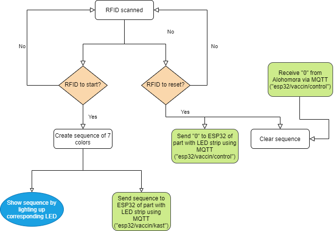
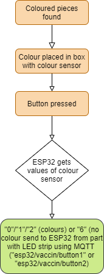
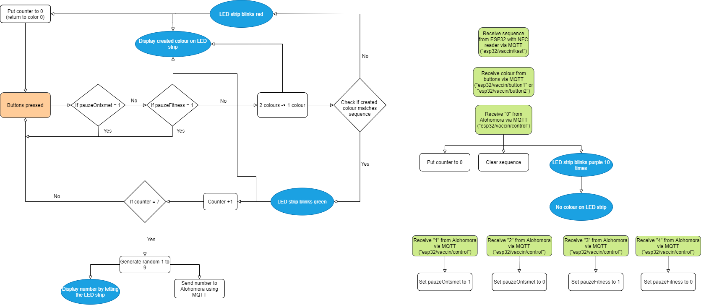

# Software

## Inhoud
- [Code](#Code)
    - [Code NFCsender](#Code_NFCsender)
    - [Code Button](#Code_Button)
    - [Code Ledstrip](#Code_Ledstrip)

- [Communicatie](#Communicatie)

## Code
Aangezien we werken met 3 verschillende PCB's moest voor elk hiervan verschillende code geschreven worden. Deze werken allemaal met een ESP32 module en kunnen geprogrammeerd worden via Arduino C/C++. De code van elke deel kan teruggevonden worden op de algemene github van dit onderdeel van de Escape room.

### Code NFCsender
Het eerste PCB dat in de schakeling gebruikt wordt is dat van de kast. Onze code is opgedeeld in 3 grote delen, namelijk de methodes om de NFC-reader op te zetten, de methodes om de MQTT communicatie te implementeren en tenslotte de setup- en loopmethodes.

In dit deel van de proef moet met een RFID tag gescand worden aan een PN532 board om de een ledsequentie te laten oplichten. Dit kan ook gebruikt worden om de hele puzzel manueel te resetten met behulp van een andere kaart.

In de loop-methode wordt steeds gekeken of er een kaart is voorgelegd aan de reader en of er een MQTT-message op één van de gevolgde kanalen is gezet. Indien de juiste kaart is voorgelegd wordt er zelf data op vershillende kanalen gezet.

Alle kanalen die gebruikt worden kunnen onderaan gevonden worden bij de sectie '[Communicatie](#Communicatie)'

### Code Button

Ten tweede hebben we twee PCB's voor de twee knoppen die gebruikt worden om de kleurensensors te activeren. Ook hier zijn de grote delen de MQTT methodes en de methodes om de kleuren te lezen. De belangrijkste is de colorChecker()-methode, deze zet de gemeten RGB-waarden om naar de gemeten kleur. Deze wordt dan later op de button kanalen van de MQTT gezet.

Ook hier wordt tijdens de loop gecheckt of de knop wordt ingedrukt, want dan dient de kleur gemeten te worden en op de juiste kanalen gezet worden.

### Code Ledstrip
In deze code worden vooral alle signalen die ontvangen worden van de andere PCB's samengebracht. De ontvangen primaire kleuren van de buttons worden gemengd tot de gewenste kleur. Deze wordt dan op de ledstrip gezet en vergeleken met de betreffende kleur van de ontvangen sequentie. 

De code moet ook ten allen tijde gepauzeerd kunnen worden door de pauze's van de fitness en de ontsmetting en mag pas hervatten wanneer beide weer oke zijn. Ook een reset is geïmplemteerd om de proef ten allen tijde te kunnen herstarten van nul.

Ten slotte wordt wanneer de hele sequentie correct is nagemaakt een random getal naar alohomora verstuurd via MQTT om het codeslot te openen.

## Communicatie
### De gebruikte kanalen van het PCB aan de NFC-reader

| topic                | bericht | betekenis                | zender | ontvanger |
|----------------------|---------|--------------------------|--------|-----------|
| esp32/vaccin/control | ‘0’     | reset de ESP-32          | X      | X         |
| esp32/vaccin/kast    | ##      | Sequentie van de kleuren | X      |           |

### De gebruikte kanalen van het PCB aan de buttons

| topic                | bericht | betekenis          | zender | ontvanger |
|----------------------|---------|--------------------|--------|-----------|
| esp32/vaccin/button# | ##      | nummer van kleur   | X      |           |

### De gebruikte kanalen van het PCB aan de ledstrip

| topic                | bericht | betekenis              | zender | ontvanger |
|----------------------|---------|------------------------|--------|-----------|
| esp32/vaccin/control | '0'     | reset de ESP-32        |        | X         |
| esp32/vaccin/control | '1'     | pauzeer de proef       |        | X         |
| esp32/vaccin/control | '2'     | pauzeer de proef       |        | X         |
| esp32/vaccin/control | '3'     | hervat de proef        |        | X         |
| esp32/vaccin/control | '4'     | hervat de proef        |        | X         |
| esp32/vaccin/button2 | ##      | nummer van kleur 2     |        | X         |
| esp32/vaccin/button1 | ##      | nummer van kleur 1     |        | X         |
| esp32/vaccin/kast    | ##      | sequentie van de kast  |        | X         |
| esp32/vaccin/number  | ##      | random nummer codeslot | X      |           |

