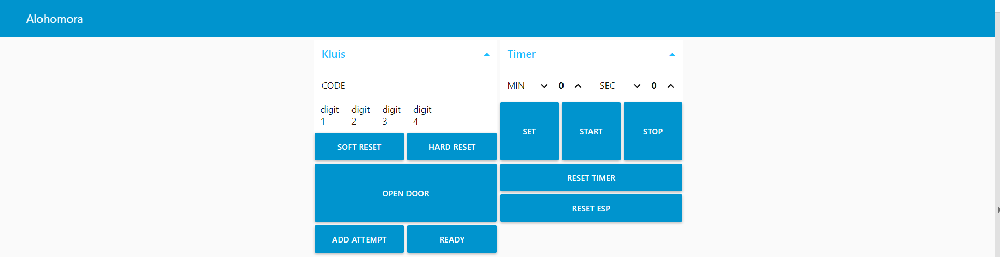

# Framework
Als MQTT broker werd ons een Raspberry Pi (v2) aangeboden. Om alle communicatie met het MQTT protocol vlot te laten verlopen moest wel nog een framework gekozen worden om op de Raspberry Pi te installeren. We lichten onze keuzes omtrent het framework voor dit project even bij.

## Mosquitto
Voor ons project hebben we als basis gekozen voor **Eclipse Mosquitto™**.
Eclipse Mosquitto is een *open source message broker* die het MQTT protocol versie 5.0, 3.1.1 en 3.1 implementeert. Mosquitto is *lightweight* en is geschikt voor gebruik op alle apparaten van *low power single board computers* tot volledige servers.
Wat ons vooral aansprak aan Mosquitto was de simpele implementatie, testen met een applicatie op een smartphone of een laptop is zeer makkelijk, en de mogelijkheid tot aanmaken van een user interface met **Node-RED** zonder extra aanpassingen.

## Node-RED
Om een gebruiksvriendelijke interface te voorzien voor onze escape room hebben we dus gebruik gemaakt van Node-RED.
Node-RED is een handige tool die toelaat om op een simpele manier *flows* te implementeren en deze *flows* virtueel met elkaar te verbinden om zo de communicatie tussen verschillende apparaten te automatiseren en/of te verduidelijken. Node-RED heeft een aantal voordelen die ons overtuigd hebben om deze tool te gebruiken, we lijsten ze even op:
- Node-RED biedt een flow editor aan die gebruikt kan worden van uit je browser. Aanmaken, bewerken, opslaan,... alles kan zonder installatie van een extra programma.
- Node-RED is gebaseerd op Node.js. Dit is vooral interessant aangezien we werken met een Raspberry Pi, Node.js is namelijk *light-weight* en zeker compatibel met *low-cost hardware* zoals Raspberry Pi.
- Ten slotte is er nog het feit dat alle *flows* en dergelijke worden opgeslaan als .js bestanden, wat een vrij leesbaar en makkelijk te delen bestandsextensie is.

# Communicatie
<div align="left">Hieronder wat verdere uitleg bij de afgesproken richtlijnen voor MQTT communicatie.</div>

## Monitoring
Om de activiteit op de broker vanop een laptop te monitoren voor debug doeleinden hebben we het volgende programma gebruikt:
https://github.com/fauresystems/mqtt-observer  
Eens alles werkte konden we Node-RED gebruiken om alles te besturen en te controleren en was dit programma niet langer nodig.

## Gebruikte channels op de broker
Enkele channels zijn voorbehouden voor gebruik voor de algemene aansturing: <br />
esp32/+/control <br />
"+" wordt hier vervangen door de naam van de proef in kwestie. <br />
(fitness, morse, 5g, vaccin, afstand, ontsmetten, alohomora) <br />
Alle andere channels mogen (voorlopig) gebruikt worden <br />
Om het overzicht te bewaren is het wel handig als de channels van de vorm "esp32/*proef*/*vrij te kiezen*" zijn.<br />

## Controle signalen
Werkwijze:
1 controle topic waar elke ESP op moet subscriben: esp32/-proef-/control (-proef- met naam vervangen)
op deze topic zijn momenteel 5 codes mogelijk waar elke ESP dan een implementatie voor moet voorzien:
- '0' RESET
- '1' STOP (afstand)
- '2' START (ontsmetten)
- '3' POWEROFF (stop voor fitness)
- '4' POWERON (start voor fitness)  

Op deze manier kan fitnesstracker alles stoppen en starten, vanop de broker kan alles gereset worden indien nodig, en voor afstand houden en ontsmetten is er dan nog een speciale situatie voorzien die ook fitness onderbreekt. Verdere uitbreiding hier is zeker mogelijk.

# GUI
Om makkelijk in te kunnen grijpen wanneer iets fout loopt hebben we een intuïtieve user interface opgesteld met Node-RED.  
Deze GUI kan gevonden worden door te verbinden met de NETGEAR68 router in de escaperoom en te surfen naar <192.168.1.2:1880/ui> .
Je zou dan een pagina moeten zien die lijkt op deze pagina:



Door linksboven te klikken zou er een dropdown menu moeten verschijnen, hier kan je de proef in kwestie aanklikken om naar het controlepaneel voor de proef in kwestie te gaan.
Elke proef ondersteunt over het algemeen dezelfde commandos, zoals ze zijn aangegeven op de knoppen, maar er zal ook voor elke proef bepaalde info terug te vinden zijn. Zo zal bij 'Alohomora' ook alle doorgestuurde code digits af te lezen zijn en een knop voorzien zijn om de kluis te openen.  
Achter elk controlepaneel zit een *flow*, deze zien er uit als volgt:


Op deze manier konden we dus vrij intuïtief een GUI ontwerpen die zonder extra uitleg zou moeten gebruikt kunnen worden.  
Voor de volledigheid voegen we nog even de code toe die zo'n flow beschrijft:

```javascript
[{
    "id": "9b4c1fd3.e14d8",
    "type": "tab",
    "label": "Alohomora: kluis",
    "disabled": false,
    "info": ""
}, {
    "id": "7db8a5b3.0deedc",
    "type": "mqtt in",
    "z": "9b4c1fd3.e14d8",
    "name": "code1",
    "topic": "esp32/alohomora/code1",
    "qos": "2",
    "datatype": "auto",
    "broker": "ffb07532.ab2548",
    "x": 230,
    "y": 340,
    "wires": [["f11d990e.682048", "fc981dce.407f2"]]
}, {
    "id": "1198c2a8.1162ed",
    "type": "mqtt in",
    "z": "9b4c1fd3.e14d8",
    "name": "code2",
    "topic": "esp32/alohomora/code2",
    "qos": "2",
    "datatype": "auto",
    "broker": "ffb07532.ab2548",
    "x": 230,
    "y": 420,
    "wires": [["c8e888ad.f0ae78", "b0991768.4cddc8"]]
}, {
    "id": "f5006732.4b6bf8",
    "type": "mqtt in",
    "z": "9b4c1fd3.e14d8",
    "name": "code3",
    "topic": "esp32/morse/output",
    "qos": "2",
    "datatype": "auto",
    "broker": "ffb07532.ab2548",
    "x": 230,
    "y": 500,
    "wires": [["d4cc13da.9d715", "bc771fe1.2fefa"]]
}, {
    "id": "1918a9fb.e7e386",
    "type": "mqtt in",
    "z": "9b4c1fd3.e14d8",
    "name": "code4",
    "topic": "esp32/alohomora/code4",
    "qos": "2",
    "datatype": "auto",
    "broker": "ffb07532.ab2548",
    "x": 230,
    "y": 580,
    "wires": [["6ff5636.b08769c", "74f612f0.bb423c"]]
}, {
    "id": "6f299506.f331ec",
    "type": "inject",
    "z": "9b4c1fd3.e14d8",
    "name": "Force ready",
    "props": [{
        "p": "payload"
    }, {
        "p": "topic",
        "vt": "str"
    }],
    "repeat": "",
    "crontab": "",
    "once": false,
    "onceDelay": 0.1,
    "topic": "esp32/alohomora/control",
    "payload": "ready",
    "payloadType": "str",
    "x": 250,
    "y": 240,
    "wires": [["109af97b.d76547"]]
}, {
    "id": "f11d990e.682048",
    "type": "mqtt out",
    "z": "9b4c1fd3.e14d8",
    "name": "code digit 1",
    "topic": "esp32/alohomora/code1",
    "qos": "2",
    "retain": "",
    "respTopic": "",
    "contentType": "",
    "userProps": "",
    "correl": "",
    "expiry": "",
    "broker": "ffb07532.ab2548",
    "x": 430,
    "y": 380,
    "wires": []
}, {
    "id": "c8e888ad.f0ae78",
    "type": "mqtt out",
    "z": "9b4c1fd3.e14d8",
    "name": "code digit 2",
    "topic": "esp32/alohomora/code2",
    "qos": "2",
    "retain": "",
    "broker": "ffb07532.ab2548",
    "x": 430,
    "y": 460,
    "wires": []
}, {
    "id": "d4cc13da.9d715",
    "type": "mqtt out",
    "z": "9b4c1fd3.e14d8",
    "name": "code digit 3",
    "topic": "esp32/alohomora/code3",
    "qos": "2",
    "retain": "",
    "broker": "ffb07532.ab2548",
    "x": 430,
    "y": 540,
    "wires": []
}, {
    "id": "6ff5636.b08769c",
    "type": "mqtt out",
    "z": "9b4c1fd3.e14d8",
    "name": "code digit 4",
    "topic": "esp32/alohomora/code4",
    "qos": "2",
    "retain": "",
    "broker": "ffb07532.ab2548",
    "x": 430,
    "y": 620,
    "wires": []
}, {
    "id": "dd09261e.970ca8",
    "type": "mqtt out",
    "z": "9b4c1fd3.e14d8",
    "name": "",
    "topic": "",
    "qos": "2",
    "retain": "",
    "broker": "ffb07532.ab2548",
    "x": 590,
    "y": 240,
    "wires": []
}, {
    "id": "7e7d094b.97ac48",
    "type": "inject",
    "z": "9b4c1fd3.e14d8",
    "name": "add attempt",
    "props": [{
        "p": "payload"
    }, {
        "p": "topic",
        "vt": "str"
    }],
    "repeat": "",
    "crontab": "",
    "once": false,
    "onceDelay": 0.1,
    "topic": "esp32/alohomora/control",
    "payload": "AddAttempt",
    "payloadType": "str",
    "x": 250,
    "y": 200,
    "wires": [["7186f0c3.8e068"]]
}, {
    "id": "75647dac.aaa234",
    "type": "mqtt out",
    "z": "9b4c1fd3.e14d8",
    "name": "",
    "topic": "",
    "qos": "2",
    "retain": "",
    "broker": "ffb07532.ab2548",
    "x": 590,
    "y": 200,
    "wires": []
}, {
    "id": "487c7487.818f6c",
    "type": "inject",
    "z": "9b4c1fd3.e14d8",
    "name": "open door",
    "props": [{
        "p": "payload"
    }, {
        "p": "topic",
        "vt": "str"
    }],
    "repeat": "",
    "crontab": "",
    "once": false,
    "onceDelay": 0.1,
    "topic": "esp32/alohomora/control",
    "payload": "open",
    "payloadType": "str",
    "x": 240,
    "y": 160,
    "wires": [["dc685f72.94b46"]]
}, {
    "id": "66ad72b8.041c8c",
    "type": "mqtt out",
    "z": "9b4c1fd3.e14d8",
    "name": "",
    "topic": "",
    "qos": "2",
    "retain": "",
    "broker": "ffb07532.ab2548",
    "x": 590,
    "y": 160,
    "wires": []
}, {
    "id": "cc454fc5.5c77b",
    "type": "inject",
    "z": "9b4c1fd3.e14d8",
    "name": "hard reset",
    "props": [{
        "p": "payload"
    }, {
        "p": "topic",
        "vt": "str"
    }],
    "repeat": "",
    "crontab": "",
    "once": false,
    "onceDelay": 0.1,
    "topic": "esp32/alohomora/control",
    "payload": "reset",
    "payloadType": "str",
    "x": 240,
    "y": 120,
    "wires": [["cc916143.9ea9c"]]
}, {
    "id": "9ed7b7a1.89fee8",
    "type": "mqtt out",
    "z": "9b4c1fd3.e14d8",
    "name": "",
    "topic": "",
    "qos": "2",
    "retain": "",
    "broker": "ffb07532.ab2548",
    "x": 590,
    "y": 120,
    "wires": []
}, {
    "id": "adf976f.9fb3888",
    "type": "mqtt out",
    "z": "9b4c1fd3.e14d8",
    "name": "",
    "topic": "",
    "qos": "2",
    "retain": "",
    "broker": "ffb07532.ab2548",
    "x": 590,
    "y": 80,
    "wires": []
}, {
    "id": "c4e548a2.155f88",
    "type": "ui_button",
    "z": "9b4c1fd3.e14d8",
    "name": "soft reset",
    "group": "3fb13bd7.a21974",
    "order": 0,
    "width": "3",
    "height": "1",
    "passthru": true,
    "label": "Soft reset",
    "tooltip": "",
    "color": "",
    "bgcolor": "",
    "icon": "",
    "payload": "start",
    "payloadType": "str",
    "topic": "esp32/alohomora/control",
    "topicType": "str",
    "x": 420,
    "y": 80,
    "wires": [["adf976f.9fb3888"]]
}, {
    "id": "a9c182d0.4cb2d",
    "type": "inject",
    "z": "9b4c1fd3.e14d8",
    "name": "soft reset",
    "props": [{
        "p": "payload"
    }, {
        "p": "topic",
        "vt": "str"
    }],
    "repeat": "",
    "crontab": "",
    "once": false,
    "onceDelay": 0.1,
    "topic": "esp32/alohomora/control",
    "payload": "start",
    "payloadType": "str",
    "x": 240,
    "y": 80,
    "wires": [["c4e548a2.155f88"]]
}, {
    "id": "cc916143.9ea9c",
    "type": "ui_button",
    "z": "9b4c1fd3.e14d8",
    "name": "hard reset",
    "group": "3fb13bd7.a21974",
    "order": 0,
    "width": "3",
    "height": "1",
    "passthru": true,
    "label": "Hard reset",
    "tooltip": "",
    "color": "",
    "bgcolor": "",
    "icon": "",
    "payload": "reset",
    "payloadType": "str",
    "topic": "esp32/alohomora/control",
    "topicType": "str",
    "x": 420,
    "y": 120,
    "wires": [["9ed7b7a1.89fee8"]]
}, {
    "id": "dc685f72.94b46",
    "type": "ui_button",
    "z": "9b4c1fd3.e14d8",
    "name": "open door",
    "group": "3fb13bd7.a21974",
    "order": 0,
    "width": "6",
    "height": "2",
    "passthru": true,
    "label": "Open door",
    "tooltip": "",
    "color": "",
    "bgcolor": "",
    "icon": "",
    "payload": "open",
    "payloadType": "str",
    "topic": "esp32/alohomora/control",
    "topicType": "str",
    "x": 420,
    "y": 160,
    "wires": [["66ad72b8.041c8c"]]
}, {
    "id": "7186f0c3.8e068",
    "type": "ui_button",
    "z": "9b4c1fd3.e14d8",
    "name": "add attempt",
    "group": "3fb13bd7.a21974",
    "order": 0,
    "width": "3",
    "height": "1",
    "passthru": true,
    "label": "Add attempt",
    "tooltip": "",
    "color": "",
    "bgcolor": "",
    "icon": "",
    "payload": "AddAttempt",
    "payloadType": "str",
    "topic": "esp32/alohomora/control",
    "topicType": "str",
    "x": 430,
    "y": 200,
    "wires": [["75647dac.aaa234"]]
}, {
    "id": "109af97b.d76547",
    "type": "ui_button",
    "z": "9b4c1fd3.e14d8",
    "name": "force ready",
    "group": "3fb13bd7.a21974",
    "order": 0,
    "width": "3",
    "height": "1",
    "passthru": true,
    "label": "Ready",
    "tooltip": "",
    "color": "",
    "bgcolor": "",
    "icon": "",
    "payload": "ready",
    "payloadType": "str",
    "topic": "esp32/alohomora/control",
    "topicType": "str",
    "x": 430,
    "y": 240,
    "wires": [["dd09261e.970ca8"]]
}, {
    "id": "362c3f22.98bde",
    "type": "inject",
    "z": "9b4c1fd3.e14d8",
    "name": "",
    "props": [{
        "p": "payload"
    }, {
        "p": "topic",
        "vt": "str"
    }],
    "repeat": "",
    "crontab": "",
    "once": false,
    "onceDelay": 0.1,
    "topic": "",
    "payload": "1",
    "payloadType": "str",
    "x": 230,
    "y": 380,
    "wires": [["f11d990e.682048"]]
}, {
    "id": "3334c78b.673918",
    "type": "inject",
    "z": "9b4c1fd3.e14d8",
    "name": "",
    "props": [{
        "p": "payload"
    }, {
        "p": "topic",
        "vt": "str"
    }],
    "repeat": "",
    "crontab": "",
    "once": false,
    "onceDelay": 0.1,
    "topic": "",
    "payload": "2",
    "payloadType": "str",
    "x": 230,
    "y": 460,
    "wires": [["c8e888ad.f0ae78"]]
}, {
    "id": "e4792bc2.df2aa8",
    "type": "inject",
    "z": "9b4c1fd3.e14d8",
    "name": "3",
    "props": [{
        "p": "payload"
    }, {
        "p": "topic",
        "vt": "str"
    }],
    "repeat": "",
    "crontab": "",
    "once": false,
    "onceDelay": 0.1,
    "topic": "esp32/alohomora/code3",
    "payload": "4",
    "payloadType": "str",
    "x": 230,
    "y": 540,
    "wires": [["d4cc13da.9d715"]]
}, {
    "id": "ffffb051.646f5",
    "type": "inject",
    "z": "9b4c1fd3.e14d8",
    "name": "",
    "props": [{
        "p": "payload"
    }, {
        "p": "topic",
        "vt": "str"
    }],
    "repeat": "",
    "crontab": "",
    "once": false,
    "onceDelay": 0.1,
    "topic": "",
    "payload": "4",
    "payloadType": "str",
    "x": 230,
    "y": 620,
    "wires": [["6ff5636.b08769c"]]
}, {
    "id": "fc981dce.407f2",
    "type": "ui_text",
    "z": "9b4c1fd3.e14d8",
    "group": "3fb13bd7.a21974",
    "order": 6,
    "width": "1",
    "height": "1",
    "name": "",
    "label": "digit 1",
    "format": "{{msg.payload}}",
    "layout": "col-center",
    "x": 410,
    "y": 340,
    "wires": []
}, {
    "id": "b0991768.4cddc8",
    "type": "ui_text",
    "z": "9b4c1fd3.e14d8",
    "group": "3fb13bd7.a21974",
    "order": 6,
    "width": "1",
    "height": "1",
    "name": "",
    "label": "digit 2",
    "format": "{{msg.payload}}",
    "layout": "col-center",
    "x": 410,
    "y": 420,
    "wires": []
}, {
    "id": "bc771fe1.2fefa",
    "type": "ui_text",
    "z": "9b4c1fd3.e14d8",
    "group": "3fb13bd7.a21974",
    "order": 6,
    "width": "1",
    "height": "1",
    "name": "",
    "label": "digit 3",
    "format": "{{msg.payload}}",
    "layout": "col-center",
    "x": 410,
    "y": 500,
    "wires": []
}, {
    "id": "74f612f0.bb423c",
    "type": "ui_text",
    "z": "9b4c1fd3.e14d8",
    "group": "3fb13bd7.a21974",
    "order": 6,
    "width": "1",
    "height": "1",
    "name": "",
    "label": "digit 4",
    "format": "{{msg.payload}}",
    "layout": "col-center",
    "x": 410,
    "y": 580,
    "wires": []
}, {
    "id": "ffb07532.ab2548",
    "type": "mqtt-broker",
    "name": "Broker",
    "broker": "192.168.1.2",
    "port": "1883",
    "clientid": "",
    "usetls": false,
    "protocolVersion": "4",
    "keepalive": "3600",
    "cleansession": true,
    "birthTopic": "esp32/info",
    "birthQos": "0",
    "birthPayload": "device connected",
    "birthMsg": {},
    "closeTopic": "esp32/info",
    "closeQos": "0",
    "closePayload": "device says goodbye",
    "closeMsg": {},
    "willTopic": "esp32/info",
    "willQos": "0",
    "willPayload": "device disconnected unexpectedly",
    "willMsg": {},
    "sessionExpiry": ""
}, {
    "id": "3fb13bd7.a21974",
    "type": "ui_group",
    "z": "9b4c1fd3.e14d8",
    "name": "Kluis",
    "tab": "73b51bea.22f084",
    "order": 1,
    "disp": true,
    "width": "6",
    "collapse": true
}, {
    "id": "73b51bea.22f084",
    "type": "ui_tab",
    "name": "Alohomora",
    "icon": "dashboard",
    "disabled": false,
    "hidden": false
}]
```
